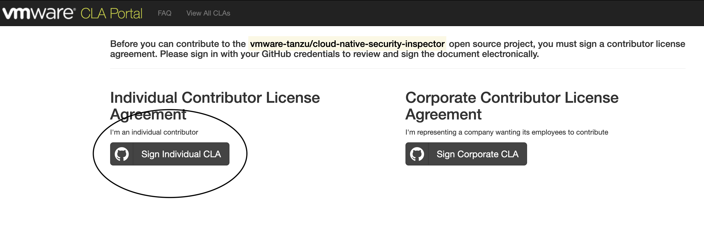
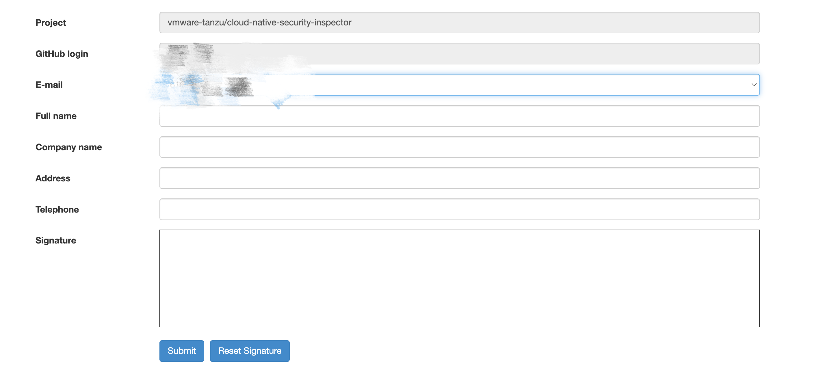

# Contributing to cloud-native-security-inspector

We welcome contributions from the community and first want to thank you for taking the time to contribute!

**Table of Contents**

* [Code of Conduct](#code-of-conduct)
* [Ways to Contribute](#ways-to-contribute)
* [Sign a Contributor License](#sign-a-contributor-license)
* [Getting Started](#getting-started)
* [Contribution Flow](#contribution-flow)
  * [Staying In Sync With Upstream](#staying-in-sync-with-upstream)
  * [Updating pull requests](#updating-pull-requests)
  * [Formatting Commit Messages](#formatting-commit-messages)
  * [Pull Request Checklist](#pull-request-checklist)
* [Reporting Bugs and Creating Issues](#reporting-bugs-and-creating-issues)
* [Ask for Help](#ask-for-help)

## Code of Conduct
Please familiarize yourself with the [Code of Conduct](https://github.com/vmware/.github/blob/main/CODE_OF_CONDUCT.md)
before contributing.

## Ways to contribute

We welcome many types of contributions and not all of them need a Pull request. Contributions may include:

* New features and proposals
* Documentation
* Bug fixes
* Issue Triage
* Answering questions and giving feedback
* Helping to onboard new contributors
* Other related activities

## Getting started

Please refer to [README](README.md) to learn more about how to build the project from source code and run.

All todo items, are recorded on the issue [page](https://github.com/vmware-tanzu/cloud-native-security-inspector/issues).
You can pick one of them by add comments below, then a maintainer can assign the feature to you.

After picking the issue, before any code change, a design doc should be proposed first.
Check the [template](docs/design/template.md) to see how to write a design doc.

After the design doc is approved by two maintainers, you can start the implementation process.
It would be nice if you can comment in the issue assigned to you about when is the feature expected to be finished,
so that the maintainers can schedule the issue in the appropriate release in the future.

## Sign a contributor license

If you would like to contribute code to cloud-native-security-inspector, you must read and sign our
Contributor License Agreement [CLA](https://cla.vmware.com/cla/1/preview). If you wish to contribute
code and you have not signed our contributor license agreement (CLA), our bot will prompt you to do 
so when you open a Pull Request. For any questions about the CLA process, please refer to our
[FAQ]([https://cla.vmware.com/faq](https://cla.vmware.com/faq)).

When you click the link for signing the CLA, please sign the individual CLA.



**Important: Make sure you provide all the information we ask you to provide, e.g., fill in each blank in below form.**



## Contribution Flow

This is a rough outline of what a contributor's workflow looks like:

* Make a fork of the repository within your GitHub account
* Create a topic branch in your fork from where you want to base your work
* Make commits of logical units
* Make sure your commit messages are with the proper format, quality and descriptiveness (see below)
* Push your changes to the topic branch in your fork
* Create a pull request containing that commit

We follow the GitHub workflow and you can find more details on the
[GitHub flow documentation](https://docs.github.com/en/get-started/quickstart/github-flow).

Example:
```shell
git remote add upstream https://github.com/vmware-tanzu/cloud-native-security-inspector.git
git checkout -b my-new-feature main
git commit -a
git push origin my-new-feature
```

### Staying In Sync With Upstream
When your branch gets out of sync with the vmware-tanzu/main branch, use the following to update:
```shell
git checkout my-new-feature
git fetch -a
git pull --rebase upstream master
git push --force-with-lease origin my-new-feature
```

### Updating pull requests
If your PR fails to pass CI or needs changes based on code review, you'll most likely want to squash these changes into existing commits.

If your pull request contains a single commit or your changes are related to the most recent commit, you can simply amend the commit.
```shell
git add .
git commit --amend
git push --force-with-lease origin my-new-feature
```

If you need to squash changes into an earlier commit, you can use:

```shell
git add .
git commit --fixup <commit>
git rebase -i --autosquash master
git push --force-with-lease origin my-new-feature
```
Be sure to add a comment to the PR indicating your new changes are ready to review, as GitHub does not generate a notification when you git push.

### Formatting Commit Messages

We follow the conventions on [How to Write a Git Commit Message](http://chris.beams.io/posts/git-commit/).

Be sure to include any related GitHub issue references in the commit message.  See
[GFM syntax](https://guides.github.com/features/mastering-markdown/#GitHub-flavored-markdown) for referencing issues
and commits.

### Pull Request Checklist

Before submitting your pull request, we advise you to use the following:

1. Make sure you code change brings no regression, e.g., you change must pass every github workflow item triggerred by your PR.
2. Ensure your commit messages are descriptive. We follow the conventions on [How to Write a Git Commit Message](http://chris.beams.io/posts/git-commit/). Be sure to include any related GitHub issue references in the commit message. See [GFM syntax](https://guides.github.com/features/mastering-markdown/#GitHub-flavored-markdown) for referencing issues and commits.
3. Check the commits and commits messages and ensure they are free from typos.
4. Make sure you have involved new tests that can verify that your change does can solve the problem.

## Reporting Bugs and Creating Issues

For specifics on what to include in your report, please follow the guidelines in the issue and pull request templates when available.
When opening a new issue, try to roughly follow the commit message format conventions above.

## Ask for Help

The best way to reach us with a question when contributing is to ask on:

* The original GitHub issue
* The developer mailing list: narrows@vmware.com
