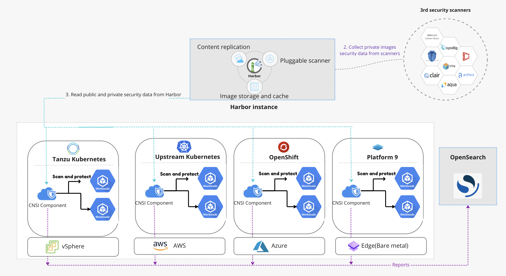

# Cloud Native Security Inspector (Project Narrows)
[](https://github.com/vmware-tanzu/cloud-native-security-inspector/actions/workflows/codeql.yml)
[](https://github.com/vmware-tanzu/cloud-native-security-inspector/actions/workflows/cypress.yml)


Cloud Native Security Inspector is an open source cloud native runtime security tool. It allows end users to assess
the security posture of Kubernetes clusters at runtime. This project will add dynamic scanning giving Security Auditors
greater awareness and control of running workloads.

## Features 
- View overall security posture of applications in runtime  
- Policy-based scanning management
- Revise baseline policies as needed and prevent redeploying workloads sourced from vulnerable images 
- Quarantine non-secure workloads 
- Review and filter the assessment reports
- Send the historical assessment reports to [OpenSearch](https://opensearch.org/) or [ElasticSearch](https://www.elastic.co/elasticsearch/)

## Architecture
    

**Cloud Native Security Inspector** consists of the following 3 components:
1. The Controller Manager
2. The Portal
3. Scanners

In regard to scanners, currently we support 3 different kinds of scanners:
### [Image vulnerability scanner](https://goharbor.io/docs/main/administration/vulnerability-scanning/)
Harbor provides static analysis of vulnerabilities in images through the open source projects [Trivy](https://github.com/aquasecurity/trivy).
In CNSI, this capability is used to perform [dynamic security application testing](https://www.gartner.com/en/information-technology/glossary/dynamic-application-security-testing-dast) (DAST).

### [Kubebench scanner](https://github.com/aquasecurity/kube-bench)
Kubebench scanner mainly cares about the underlying Kubernetes cluster. 
It checks whether Kubernetes is deployed securely by running the checks documented in the [CIS Kubernetes Benchmark](https://www.cisecurity.org/benchmark/kubernetes/).

### [Risk Scanner (contributed by Arksec Beijing Ltd)](https://arksec.cn/)
The Risk scanner fetches the [CVSS vectors](https://qualysguard.qg2.apps.qualys.com/qwebhelp/fo_portal/setup/cvss_vector_strings.htm)
from the image vulnerability report, then reports scored-risks it observed in the vector.

## Demo
[Video Demo](https://youtu.be/IMxU0UWo-DU) - Demo for Cloud Native Security Inspector features

## Prerequisites
- Ubuntu Linux as the operating system of the installation machine
- [Kubernetes](https://kubernetes.io/) 1.24
- [Harbor](https://goharbor.io/) 2.5.0+ is deployed and [vulnerability scanning in Harbor](https://goharbor.io/docs/main/administration/vulnerability-scanning/) is configured properly.
- [kubectl](https://kubernetes.io/docs/reference/kubectl/) and docker commands are ready to use.

## Deployment & Run
Follow the instructions below to deploy the Cloud Native Security Inspector.
There are two deployment options:
- Using pre-built images
- Building images from scratch  

### Option 1: Using pre-built images (recommended)
Using the following command to clone the source code:
```shell
$ git clone https://github.com/vmware-tanzu/cloud-native-security-inspector.git
```
Use the following commands to deploy the **Cloud Native Security Inspector** and other related components, and make sure the Kubernetes cluster has an Internet connection.

```shell
$ cd cloud-native-security-inspector

$ ./deploy.sh install
```


### Option 2: Building images from scratch
Instead of using the pre-built images, users can also choose to build the images from source. Optionally, after the images are built, they can be pushed to a registry service. (either Harbor or DockerHub). Use the following command to clone the source code:
```shell
$ git clone https://github.com/vmware/cloud-native-security-inspector.git
```
Before building the images, please ensure you have installed and configured the golang SDK correctly. To install the golang SDK, please familiarize yourself with the [Golang documentation](https://go.dev/doc/install). 

Use the following commands to compile the source code and build the docker images. After that, the images are generated and pushed to registry, then deployed. 
```shell
$ cd cloud-native-security-inspector
$ ./deploy.sh install --build-source
```

### Verifying the deployment
After the installation is completed either via Option 1 or Option 2, use the following command to see if all the components have been started successfully in Kubernetes.

```shell
# Verify the manager and portal
kubectl get deployment -n cnsi-system
NAME                                     READY   UP-TO-DATE   AVAILABLE   AGE
cloud-native-security-inspector-portal   1/1     1            1           93m
cnsi-controller-manager                  1/1     1            1           93m

# Verify other resource of portal deployment
$ kubectl get serviceaccount -n cnsi-system cloud-native-security-inspector-portal-serviceaccount
NAME                                                    SECRETS   AGE
cloud-native-security-inspector-portal-serviceaccount   0         166m

$ kubectl get clusterRole -n cnsi-system cloud-native-security-inspector-portal-role
NAME                                          CREATED AT
cloud-native-security-inspector-portal-role   2022-08-10T06:33:01Z

$ kubectl get clusterrolebinding -n cnsi-system cloud-native-security-inspector-portal-rolebinding
NAME                                                 ROLE                                                      AGE
cloud-native-security-inspector-portal-rolebinding   ClusterRole/cloud-native-security-inspector-portal-role   130m

$ kubectl get svc -n cnsi-system cloud-native-security-inspector-portal-service
NAME                                             TYPE       CLUSTER-IP     EXTERNAL-IP   PORT(S)          AGE
cloud-native-security-inspector-portal-service   NodePort   10.98.232.35   <none>        3800:32541/TCP   44h
```

### Run
- Refer to the [Tutorial](docs/TUTORIAL.md) for a quick guidance.
- Refer to the [User Guide](docs/USER-GUIDE.md) for more details on how to use Cloud Native Security Inspector.

### Uninstalling
To uninstall Cloud Native Security Inspector, use the following command:
```shell
$ ./deploy.sh uninstall 
```
For more details, please refer to the [User Guide](docs/USER-GUIDE.md).

## Contact us
Email: narrows@vmware.com  


## License
Cloud Native Security Inspector is available under the [Apache 2 license](LICENSE).
