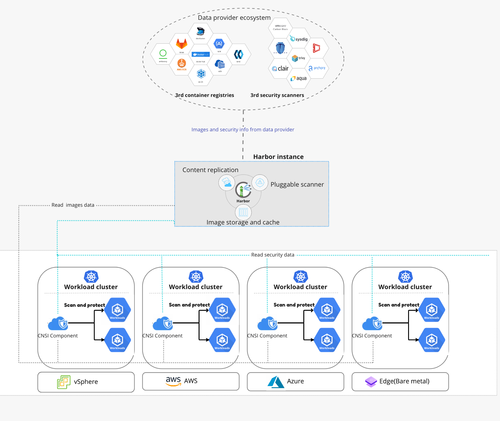

# Cloud Native Security Inspector 

Cloud Native Security Inspector is an open source cloud native runtime security tool that works with Harbor. It allows end users to assess the security posture of Kubernetes clusters at runtime. This project will add dynamic scanning giving Security Auditors greater awareness and control of running workloads.

## Features 
- View overall security posture of applications in runtime  
- Create policies and bug scanning jobs  
- Revise baseline policies as needed and prevent redeploying workloads sourced from vulnerable images 
- Set up a policy to quarantine non-secure workloads 
- Review, filter, and remove policy reports  
- Generate assessment reports with every scan 
- View notifications about flagged pods 


## 1. Architecture
    

**Project Cloud-Native-Security-Inspector** consists of the following 3 components:
- 1.Controller Manager
- 2.Inspector
- 3.Portal

## 2. Demo
[Video Demo](https://youtu.be/IMxU0UWo-DU) - Demo for Cloud-Native-Security-Inspector features

## 3. Prerequisites
- Ubuntu Linux as the operating system of the installation machine
- [Kubernetes](https://kubernetes.io/) 1.24
- [Harbor](https://goharbor.io/) 2.5.0+ is deployed and [vulnerability scanning in Harbor](https://goharbor.io/docs/main/administration/vulnerability-scanning/) is configured properly.
- [kubectl](https://kubernetes.io/docs/reference/kubectl/) and docker commands are ready to use.

## 4. Deployment & Run
Follow the instructions below to deploy Cloud Native Security Inspector.   
Refer to the [documentation](USER-GUIDE.md) for more details on how to use Cloud Native Security Inspector.  
There are two deployment options:
- Using pre-built images
- Building images from scratch  

### Option 1: Using pre-built images (recommended)
Using the following command to clone the source code:
```shell
$ git clone https://github.com/vmware-tanzu/cloud-native-security-inspector.git
```
Use the following commands to deploy the **Cloud Native Security Inspector** and other related components, and make sure the Kubernetes cluster has an Internet connection.

```shell
$ cd cloud-native-security-inspector

$ ./deploy.sh install
```


### Option 2: Building images from scratch
Instead of using the pre-built images, users can also choose to build the images from source. Optionally, after the images are built, they can be pushed to a registry service. (either Harbor or DockerHub). Use the following command to clone the source code:
```shell
$ git clone https://github.com/vmware/cloud-native-security-inspector.git
```
Before building the images, please ensure you have installed and configured the golang SDK correctly. To install the golang SDK, please familiarize yourself with the [Golang documentation](https://go.dev/doc/install). 

Use the following commands to compile the source code and build the docker images. After that, the images are generated and pushed to registry, then deployed. 
```shell
$ cd cloud-native-security-inspector
$ ./deploy.sh install --build-source
```


### Verifying the deployment
After the installation is completed either via Option 1 or Option 2, use the following command to see if all the components have been started successfully in Kubernetes.

```shell
# Verify the manager and portal
kubectl get deployment -n cnsi-system
NAME                                     READY   UP-TO-DATE   AVAILABLE   AGE
cloud-native-security-inspector-portal   1/1     1            1           93m
cnsi-controller-manager                  1/1     1            1           93m

# Verify other resource of portal deployment
$ kubectl get serviceaccount -n cnsi-system cloud-native-security-inspector-portal-serviceaccount
NAME                                                    SECRETS   AGE
cloud-native-security-inspector-portal-serviceaccount   0         166m

$ kubectl get clusterRole -n cnsi-system cloud-native-security-inspector-portal-role
NAME                                          CREATED AT
cloud-native-security-inspector-portal-role   2022-08-10T06:33:01Z

$ kubectl get clusterrolebinding -n cnsi-system cloud-native-security-inspector-portal-rolebinding
NAME                                                 ROLE                                                      AGE
cloud-native-security-inspector-portal-rolebinding   ClusterRole/cloud-native-security-inspector-portal-role   130m

$ kubectl get svc -n cnsi-system cloud-native-security-inspector-portal-service
NAME                                             TYPE       CLUSTER-IP     EXTERNAL-IP   PORT(S)          AGE
cloud-native-security-inspector-portal-service   NodePort   10.98.232.35   <none>        3800:32541/TCP   44h
```

If you are using KIND to deploy Kubernetes, in order to visit the portal successfully, please make the NodePort (by default: 30150) of the portal has been exposed to the host machine correctly.  For more details please refer to [KIND documentation](https://kind.sigs.k8s.io/docs/user/quick-start/#mapping-ports-to-the-host-machine).

### Uninstalling
To uninstall Cloud-Native-Security-Inspector, use the following command:
```shell
$ ./deploy.sh uninstall 
```
For more details, please refer to the [user guide](USER-GUIDE.md).
## 5. Contact us
Email: narrows @ vmware.com  


## 6. License
Cloud Native Security Inspector is available under the [Apache 2 license](LICENSE)
