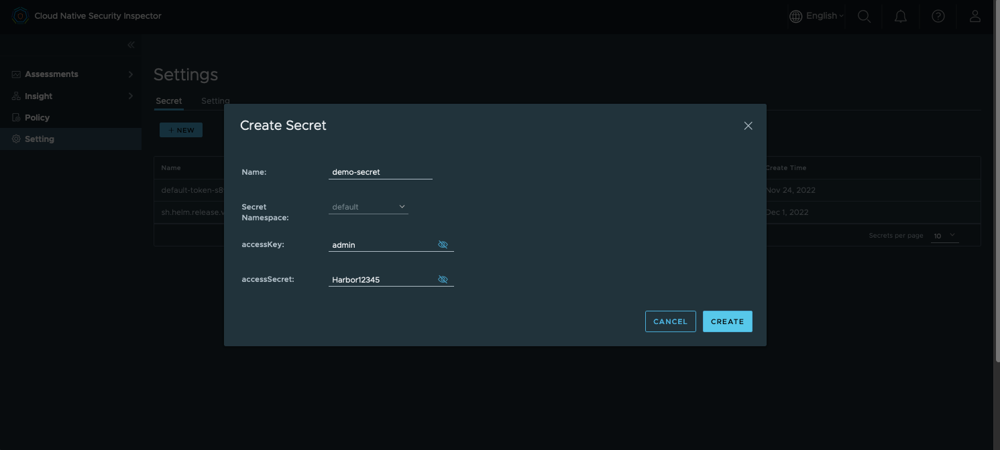

# Tutorial
In this tutorial, we will from scratch to install a MiniKube for Kubernetes
and deploy the cloud native security inspector (CNSI) on it. We will install a
Nginx workload for demo purpose, and use CNSI to scan the vulnerability of this
Nginx workload.

## Prerequisite
* A Linux machine. The verified OS is CentOS Linux release 7.9.2009 (Core).
* The demo machine has a 32-core CPU, 64G memory.
* Docker has been installed on the Linux machine. Reference: [Install Docker in CentOS7] (https://www.digitalocean.com/community/tutorials/how-to-install-and-use-docker-on-centos-7)
* You need to have a [Harbor](https://goharbor.io/) 2.5.0+ instance and [vulnerability scanning in Harbor](https://goharbor.io/docs/main/administration/vulnerability-scanning/) is configured properly

## Prepare a K8s cluster

There are many ways to deploy a K8s cluster, we choose Minikube in this tutorial.
Run below 3 commands for installing kubectl, minikube and start the 1-node K8s cluster:
```
curl -LO https://storage.googleapis.com/kubernetes-release/release/v1.23.0/bin/linux/amd64/kubectl && chmod +x ./kubectl && sudo mv ./kubectl /usr/bin
curl -LO https://github.com/kubernetes/minikube/releases/download/v1.23.0/minikube-linux-amd64 && mv minikube-linux-amd64 minikube && chmod +x minikube && sudo mv ./minikube /usr/bin
sudo minikube start --vm-driver=none --kubernetes-version v1.23.0
```
Verification:
```
➜  ~ kubectl get pods -A
NAMESPACE     NAME                                                      READY   STATUS    RESTARTS   AGE
kube-system   coredns-64897985d-nl4wx                                   1/1     Running   0          9m37s
kube-system   etcd-control-plane.minikube.internal                      1/1     Running   0          9m49s
kube-system   kube-apiserver-control-plane.minikube.internal            1/1     Running   0          9m51s
kube-system   kube-controller-manager-control-plane.minikube.internal   1/1     Running   0          9m49s
kube-system   kube-proxy-6vrff                                          1/1     Running   0          9m37s
kube-system   kube-scheduler-control-plane.minikube.internal            1/1     Running   0          9m49s
kube-system   storage-provisioner                                       1/1     Running   0          9m48s
```

## Deploy CNSI on the K8s cluster

### Install the dependencies
```
yum -y install git wget gcc
wget https://get.helm.sh/helm-v3.9.0-linux-amd64.tar.gz
tar -zxvf helm-v3.9.0-linux-amd64.tar.gz
mv linux-amd64/helm /usr/local/bin/helm
```
### Install CNSI
```
git clone https://github.com/vmware-tanzu/cloud-native-security-inspector.git
cd cloud-native-security-inspector
./deploy.sh install
```
The `./deploy.sh install` command will help you install an Opensearch service by helm.
Opensearch is used to store the assessment reports. CNSI supports using [Open Search](https://opensearch.org/) and
[Elastic Search](https://www.elastic.co/) to store the assessment reports.

The user is responsible for preparing Opensearch or Elasticsearch. The one installed by deploy.sh
is for POC purpose.

Verification:

```
➜  ~  kubectl get all -n cnsi-system
NAME                                                          READY   STATUS    RESTARTS   AGE
pod/cloud-native-security-inspector-portal-6656444dd5-nx5x5   1/1     Running   0          20h
pod/cnsi-controller-manager-7c756fd8d8-lhk85                  2/2     Running   0          7m13s

NAME                                                     TYPE        CLUSTER-IP      EXTERNAL-IP   PORT(S)          AGE
service/cloud-native-security-inspector-portal-service   NodePort    10.107.70.236   <none>        3800:30150/TCP   20h
service/cnsi-controller-manager-metrics-service          ClusterIP   10.101.31.8     <none>        8443/TCP         7m13s

NAME                                                     READY   UP-TO-DATE   AVAILABLE   AGE
deployment.apps/cloud-native-security-inspector-portal   1/1     1            1           20h
deployment.apps/cnsi-controller-manager                  1/1     1            1           7m13s

NAME                                                                DESIRED   CURRENT   READY   AGE
replicaset.apps/cloud-native-security-inspector-portal-6656444dd5   1         1         1       20h
replicaset.apps/cnsi-controller-manager-7c756fd8d8                  1         1         1       7m13s
```

Now you are able to access the CNSI portal through clusterIp:30150, because the portal is a NodePort service.

```
➜  ~  kubectl get all -n opensearch
NAME                              READY   STATUS    RESTARTS   AGE
pod/opensearch-cluster-master-0   1/1     Running   0          2m40s

NAME                                         TYPE        CLUSTER-IP       EXTERNAL-IP   PORT(S)                         AGE
service/opensearch-cluster-master            NodePort    10.105.223.105   <none>        9200:32705/TCP,9300:31004/TCP   2m40s
service/opensearch-cluster-master-headless   ClusterIP   None             <none>        9200/TCP,9300/TCP               2m40s

NAME                                         READY   AGE
statefulset.apps/opensearch-cluster-master   1/1     2m40s
```
The default username and password are "admin".
```
➜  ~  curl -XGET https://10.186.2.130:32705 -u 'admin:admin' --insecure
{
  "name" : "opensearch-cluster-master-0",
  "cluster_name" : "opensearch-cluster",
  "cluster_uuid" : "ABlUQ9GGS3y0jYKJ1s5QJw",
  "version" : {
    "distribution" : "opensearch",
    "number" : "2.4.0",
    "build_type" : "tar",
    "build_hash" : "744ca260b892d119be8164f48d92b8810bd7801c",
    "build_date" : "2022-11-15T04:42:29.671309257Z",
    "build_snapshot" : false,
    "lucene_version" : "9.4.1",
    "minimum_wire_compatibility_version" : "7.10.0",
    "minimum_index_compatibility_version" : "7.0.0"
  },
  "tagline" : "The OpenSearch Project: https://opensearch.org/"
}
```
We will configure this opensearch endpoint in the CNSI's portal.

## Inspect the workload with CNSI
### Create a Setting
Now type `<your_node_ip>:30150` on the browser of your laptop (which must have
network access to your CentOS node). You will see the CNSI portal UI:


However, the UI is empty for now, you need to start from the Setting and the Policy.

The concept of Setting in CNSI is basically a configuration CRD that points CNSI
to the Harbor instance that will be used to serve vulnerability scanning results.
The secret essentially contains the admin access credentials to that Harbor instance.
TLS verification needs to be skipped as everything is running in private certs.

Now set the secrets of the harbor instance:



You need to change the access key and secret to your **admin's** account.

Then create a new Setting:

Remember to change the Harbor endpoint to yours.

Then verify that the setting is in healthy status:


There is an equivalent for above steps by using CLI
```
cat <<EOF | kubectl apply -f -
apiVersion: v1
data:
  accessKey: YWRtaW4=
  accessSecret: SGFyYm9yMTIzNDU=
kind: Secret
metadata:
  name: harbor
  namespace: default
type: Opaque
---
apiVersion: goharbor.goharbor.io/v1alpha1
kind: Setting
metadata:
  name: demo-setting
spec:
  dataSource:
    credentialRef:
      name: harbor
      namespace: default
    provider: Harbor
    name: source-harbor
    endpoint: https://<harbor instance api>
    scanSchedule: "0 0 0 * * *"
    skipTLSVerify: true
EOF
```

### Create a Workload which will be inspected

For demo purpose, we create a nginx workload.

```
cat <<EOF | kubectl apply -f -
apiVersion: v1
kind: Namespace
metadata:
  name: workloads
  labels:
    goharbor.io/watch: "true"
---
apiVersion: v1
kind: Secret
metadata:
  name: regcred
  namespace: workloads
data:
  .dockerconfigjson: eyJhdXRocyI6eyIxMC4yMTIuNDcuMTU3Ijp7InVzZXJuYW1lIjoiYWRtaW4iLCJwYXNzd29yZCI6IkhhcmJvcjEyMzQ1IiwiYXV0aCI6IllXUnRhVzQ2U0dGeVltOXlNVEl6TkRVPSJ9fX0=
type: kubernetes.io/dockerconfigjson
---
apiVersion: apps/v1
kind: Deployment
metadata:
  name: nginx-sample
  namespace: workloads
  labels:
    app: nginx
spec:
  replicas: 1
  selector:
    matchLabels:
      app: nginx
  template:
    metadata:
      labels:
        app: nginx
    spec:
      containers:
        - name: nginx
          image: <your harbor instance>/nginx-slim:0.26
          ports:
            - containerPort: 80
      imagePullSecrets:
        - name: regcred
EOF
```
The namespace will be used in the next step when we set the policy.
This image should be from your harbor instance.

Verification:
```
➜  ~  kubectl get all -n workloads
NAME                                READY   STATUS    RESTARTS   AGE
pod/nginx-sample-6bcd9f8d57-crx9s   1/1     Running   0          17s

NAME                           READY   UP-TO-DATE   AVAILABLE   AGE
deployment.apps/nginx-sample   1/1     1            1           17s

NAME                                      DESIRED   CURRENT   READY   AGE
replicaset.apps/nginx-sample-6bcd9f8d57   1         1         1       17s
```

### Create a Policy for inspection
The CNSI Policy defines 3 things:
1. Which scanner will be used to scan which namespace or workload.
2. The scanning will be conducted by what frequency.
3. Where to export the assessment results.

picture placeholder

The CLI equivalent is:
```
cat <<EOF | kubectl apply -f -
apiVersion: goharbor.goharbor.io/v1alpha1
kind: InspectionPolicy
metadata:
  name: inspectionpolicy-sample
spec:
  settingsName: sample-setting
  enabled: true
  workNamespace: cronjobs
  schedule: "*/1 * * * *"
  strategy:
    historyLimit: 5
    suspend: false
    concurrencyRule: "Forbid"
  inspector:
    image: projects.registry.vmware.com/cnsi/inspector:0.1
    kubebenchImage: projects.registry.vmware.com/cnsi/kubebench:0.1
    imagePullPolicy: Always
  inspection:
    namespaceSelector:
      matchLabels:
        goharbor.io/watch: "true"
    assessment:
      generate: true
      format: "YAML"
      liveTime: 3600
      managedBy: true
      elasticSearchEnabled: false
      openSearchEnabled: true
      openSearchAddr: "https://opensearch-cluster-master.opensearch.svc.cluster.local:9200"
      openSearchUser: "admin"
      openSearchPasswd: "admin"
    baselines:
      - kind: "vulnerability"
        baseline: "High"
        version: "v1.1"
        scheme: "application/vnd.security.vulnerability.report; version=1.1"
    actions:
      - kind: "quarantine_vulnerable_workload"
EOF
```

Create this policy also means create cronjobs in the namespace specified by `workNamespace`.
```
➜  ~  kubectl get cronjob -n cronjobs
NAME                                      SCHEDULE      SUSPEND   ACTIVE   LAST SCHEDULE   AGE
inspectionpolicy-sampleg6fd2--kubebench   */1 * * * *   False     0        3s              26m
inspectionpolicy-samplek7jvt--inspector   */1 * * * *   False     0        3s              26m
```

```
➜  ~  kubectl get all -n cronjobs
NAME                                                         READY   STATUS      RESTARTS   AGE
pod/inspectionpolicy-sampleg6fd2--kubebench-27828442-g52ts   0/1     Completed   0          4m49s
pod/inspectionpolicy-sampleg6fd2--kubebench-27828443-9mlbx   0/1     Completed   0          3m49s
pod/inspectionpolicy-sampleg6fd2--kubebench-27828444-n7d4s   0/1     Completed   0          2m49s
pod/inspectionpolicy-sampleg6fd2--kubebench-27828445-tgpzd   0/1     Completed   0          109s
pod/inspectionpolicy-sampleg6fd2--kubebench-27828446-gczxv   0/1     Completed   0          49s
pod/inspectionpolicy-samplek7jvt--inspector-27828442-q29hs   0/1     Completed   0          4m49s
pod/inspectionpolicy-samplek7jvt--inspector-27828443-b84x2   0/1     Completed   0          3m49s
pod/inspectionpolicy-samplek7jvt--inspector-27828444-z85vd   0/1     Completed   0          2m49s
pod/inspectionpolicy-samplek7jvt--inspector-27828445-qf4mx   0/1     Completed   0          109s
pod/inspectionpolicy-samplek7jvt--inspector-27828446-hw96n   0/1     Completed   0          49s

NAME                                                    SCHEDULE      SUSPEND   ACTIVE   LAST SCHEDULE   AGE
cronjob.batch/inspectionpolicy-sampleg6fd2--kubebench   */1 * * * *   False     0        49s             33m
cronjob.batch/inspectionpolicy-samplek7jvt--inspector   */1 * * * *   False     0        49s             33m

NAME                                                         COMPLETIONS   DURATION   AGE
job.batch/inspectionpolicy-sampleg6fd2--kubebench-27828442   1/1           3s         4m49s
job.batch/inspectionpolicy-sampleg6fd2--kubebench-27828443   1/1           3s         3m49s
job.batch/inspectionpolicy-sampleg6fd2--kubebench-27828444   1/1           3s         2m49s
job.batch/inspectionpolicy-sampleg6fd2--kubebench-27828445   1/1           2s         109s
job.batch/inspectionpolicy-sampleg6fd2--kubebench-27828446   1/1           2s         49s
job.batch/inspectionpolicy-samplek7jvt--inspector-27828442   1/1           2s         4m49s
job.batch/inspectionpolicy-samplek7jvt--inspector-27828443   1/1           2s         3m49s
job.batch/inspectionpolicy-samplek7jvt--inspector-27828444   1/1           2s         2m49s
job.batch/inspectionpolicy-samplek7jvt--inspector-27828445   1/1           3s         109s
job.batch/inspectionpolicy-samplek7jvt--inspector-27828446   1/1           3s         49s
```
As `historyLimit` is specified to 5, we can check at most 5 historical cronjobs of each scanner.

We will find that assessment reports are generated as well:
```
➜  ~  kubectl get assessmentreport -n cronjobs
NAME                                 AGE
assessment-report-20221129-0654-02   34m
assessment-report-20221129-0655-02   33m
assessment-report-20221129-0656-02   32m
assessment-report-20221129-0657-02   31m
assessment-report-20221129-0658-02   30m
...
assessment-report-20221129-0728-02   44s
```

### Check the assessment reports
We can check the assessment report of the image inspector provided by harbor's vulnerability scanning
service. We can also check the report provided by kubebench.

picture placeholder

If you would like to check one assessment report by CLI:
```
➜  ~  kubectl get assessmentreport assessment-report-20221129-0728-02 -n cronjobs -o yaml
apiVersion: goharbor.goharbor.io/v1alpha1
kind: AssessmentReport
metadata:
  annotations:
    goharbor.io/creation-timestamp: "1669706882"
    goharbor.io/inspection-policy: inspectionpolicy-sample
  creationTimestamp: "2022-11-29T07:28:02Z"
  generation: 1
  name: assessment-report-20221129-0728-02
  namespace: cronjobs
  ownerReferences:
  - apiVersion: goharbor.goharbor.io/v1alpha1
    blockOwnerDeletion: true
    controller: true
    kind: InspectionPolicy
    name: inspectionpolicy-sample
    uid: 3d29e377-eda0-4e70-bab8-eb7791454b7b
  resourceVersion: "504513"
  uid: 36398687-a8b7-4340-b066-57d79e478b04
spec:
  inspectionConfiguration:
    actions:
    - kind: quarantine_vulnerable_workload
    assessment:
      elasticSearchAddr: ""
      elasticSearchCert: ""
      elasticSearchEnabled: false
      elasticSearchPasswd: ""
      elasticSearchUser: ""
      format: YAML
      generate: true
      liveTime: 3600
      managedBy: true
      openSearchAddr: https://opensearch-cluster-master.opensearch.svc.cluster.local:9200
      openSearchCert: ""
      openSearchEnabled: true
      openSearchPasswd: admin
      openSearchUser: admin
    baselines:
    - baseline: High
      kind: vulnerability
      scheme: application/vnd.security.vulnerability.report; version=1.1
      version: v1.1
    namespaceSelector:
      matchLabels:
        goharbor.io/watch: "true"
  namespaceAssessments:
  - namespace:
      name: workloads
    workloadAssessments:
    - passed: true
      workload:
        metadata:
          apiVersion: apps/v1
          kind: Deployment
          name: nginx-sample
          namespace: workloads
          uid: 4dcf0f46-4fbb-4c01-ae84-ea67fe592c6e
        pods:
        - containers:
          - id: docker://08ab9e795f23eb21ceddb4c19300a7229f1e59348bd7d5c769ea587a8f885a52
            image: 10.212.47.157/cnsi-test/nginx-slim:0.26
            imageID: docker-pullable://10.212.47.157/cnsi-test/nginx-slim@sha256:f67828dbd791ec61f95ecb37e91caefae32a96a18b78f656e602a4f7fb493409
            isInit: false
            name: nginx
          metadata:
            apiVersion: v1
            kind: Pod
            name: nginx-sample-6bcd9f8d57-crx9s
            namespace: workloads
            resourceVersion: "391681"
            uid: 5a362921-ab0a-47c7-b05b-e57203ff20c7
```

### Check the insights
placeholder
