# User Guide
  - [1. To start using Cloud Native Security Inspector](#1-to-start-using-cloud-native-security-inspector)
    - [1.1 With portal (recommended)](#11-with-portal-recommended)
      - [1.1.1 Configurations](#111-configurations)
        - [Secret](#secret)
        - [Setting](#setting)
          - [DataSource](#datasource)
          - [KnownRegistry](#knownregistry)
          - [Cache](#cache)
        - [Policy](#policy)
          - [Inspection Settings](#inspection-settings)
          - [Baselines](#baselines)
          - [Namespace Labels Selectors](#namespace-labels-selectors)
          - [Workload Labels Selectors](#workload-labels-selectors)
          - [Assessment Settings](#assessment-settings)
          - [Actions](#actions)
      - [1.1.2 Assessments](#112-assessments)
      - [1.1.3 Insight](#113-insight)
        - [Cluster](#cluster)
        - [Namespace](#namespace)
        - [Workload](#workload)
    - [1.2 With CLI](#12-with-cli)
      - [1.2.1 Settings](#121-settings)
      - [1.2.2 Policy](#122-policy)
        - [1.2.2.1 Actions](#1221-actions)
      - [1.2.3 Assessment report](#123-assessment-report)
  - [2. Troubleshooting](#2-troubleshooting)
    - [2.1 With portal](#21-build-portal-from-scratch)
----

## 1. To start using Cloud Native Security Inspector (CNSI)
### 1.1 With portal (recommended)
#### 1.1.1 Configurations

1. Get Kubernetes node IP

```shell
$ kubectl get nodes -o wide

NAME        STATUS   ROLES           AGE   VERSION   INTERNAL-IP     EXTERNAL-IP   OS-IMAGE             KERNEL-VERSION       CONTAINER-RUNTIME
junhao-vm   Ready    control-plane   52d   v1.24.2   10.117.32.162   <none>        Ubuntu 18.04.6 LTS   4.15.0-189-generic   containerd://1.6.6
```
2. In the browser address bar enter:
  ```shell
    http://10.117.32.162:30150
  ```

3. Create a Secret first, then create a Setting. The Setting is mainly about Harbor related configurations.

###### Secret
Create a secret for Harbor so that Cloud-Native-Security-Inspector can talk to Harbor with the credentials.
The secret you created will be referred by the setting. If you have already had the K8s secret, you can skip creating one and move forward to next step.


| Field Name    | Type   | Description            |
|---------------|--------|------------------------|
| accessKey     | string | The username of Harbor |
| accessSecret  | string | The password of Harbor |
| Name          | string | The secret's name      |
| Namespace     | string | The secret's namespace |

##### Setting
Click on "Credential Name" and choose the secret you've created in previous step. 
You also need to specify the endpoint of Harbor and the scan interval.


###### Required Fields

| Field Name           | Field Type  | Description                                                                       |
|----------------------|-------------|-----------------------------------------------------------------------------------|
| Setting Name         | string      | The name of the data source                                                       |
| Credential Name      | string      | The name of the credential of data source                                         |
| Credential Namespace | string      | The namespace of the credential of data source                                    |
| Provider             | string      | The provider of the data source, currently only support Harbor                    |
| Name                 | string      | The name of the datasource setting, auto-generated and can't be modified          |
| Endpoint             | URL(string) | The endpoint of the data source                                                   |
| Schedule             | string      | The cron expression to be configured in Harbor to specify the CVE update interval |
| skipTLSVerify        | boolean     | Whether need to skip the TLS verify                                               |


###### KnownRegistry
This field is optional. If it is configured, replicate rules are set up in Harbor and images from 
KnowRegistries can be automatically replicated to Harbor.

| Field Name           | Field Type  | Description                                                                  |
|----------------------|-------------|------------------------------------------------------------------------------|
| provider             | string      | The provider of the registry, currently supports the adapter lists in Harbor |
| name                 | string      | The name of the registry                                                     |
| endpoint             | URL(string) | The endpoint of the registry                                                 |
| Credential Name      | string      | The name of the credential of KnownRegistry                                  |
| Credential Namespace | string      | The namespace of the credential of KnownRegistry                             |
| skipTLSVerify        | boolean     | Whether need to skip the TLS verify                                          |

  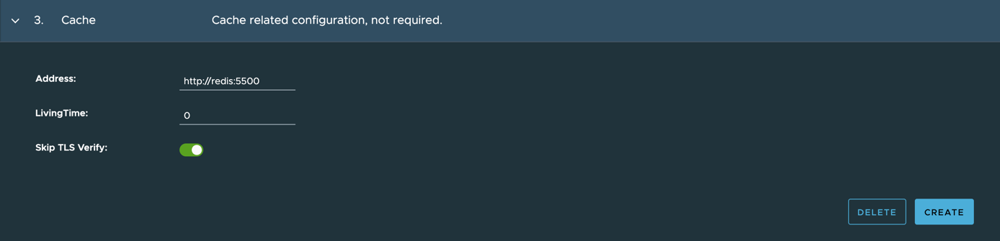


###### Cache
This filed is optional. If it is configured. Cloud-Native-Security-Inspector can use the external Redis you specified here to cache the security data from Harbor.

| Field Name    | Field Type  | Description                                                                                              |
|---------------|-------------|----------------------------------------------------------------------------------------------------------|
| address       | URL(string) | The URL of the redis address                                                                             |
| livingTime    | int64       | LivingTime (seconds) specifies the living time of the cache data                                         |
| skipTLSVerify | boolean     | SkipTLSVerify indicates whether skip the TLS verification. Only active when 'redis' scheme is configured |
  


  4.  Once the Setting is all set. Open the policy menu and define the inspection policy according to your security requirements. By defining the inspection policy, users can specify their security expectations including scan interval, security baseline, and the workloads or namespaces that should be scanned.
  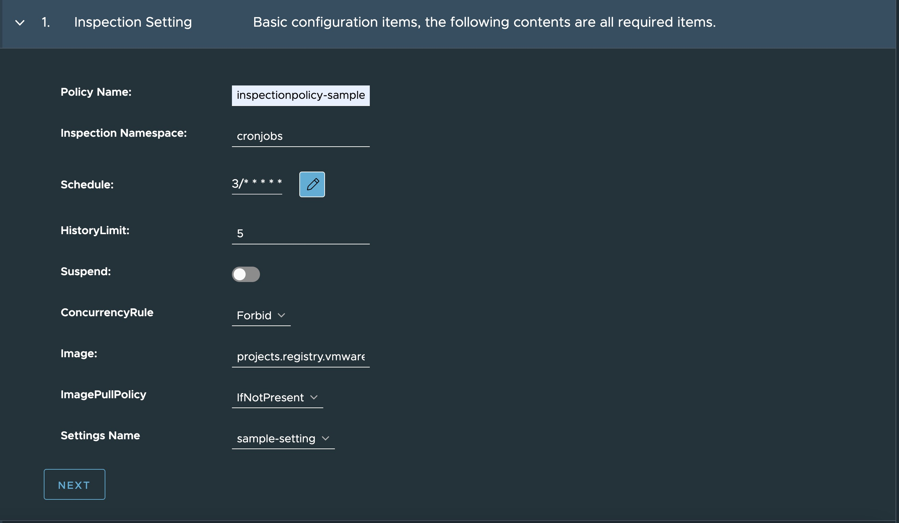


#### Policy
###### Inspection Settings
| Field Name      | Field Type        | Description                                                                          |
|-----------------|-------------------|--------------------------------------------------------------------------------------|
| Policy Name     | string            | Users can customize the name of this policy                                          |
| Worknamespace   | *string           | WorkNamespace specify the namespace for creating the underlying inspection resources |
| Schedule        | string            | Configure Inspection scan cycle                                                      |
| HistoryLimit    | *int32            | HistoryLimit limits the max number of the completed inspections                      |
| Suspend         | *bool             | If true, suspend the subsequent inspections temporarily                              |
| ConcurrencyRule | string            | ConcurrencyRule indicates how to handle the overlapped inspector processes           |
| Scan Inspector  | string            | The inspector which will be used by this policy                                      |
| ImagePullPolicy | corev1.PullPolicy | Image pull policy. Choose from Always, IfNotPresent and Never                        |
| Settings Name   | string            | Select the existing setting's name                                                   |
| OpenSearch      | multiple configs  | Enable this to leverage OpenSearch to store the time-series assessment reports       |
| ElasticSearch   | multiple configs  | Enable this to leverage ElasticSearch to store the time-series assessment reports    |

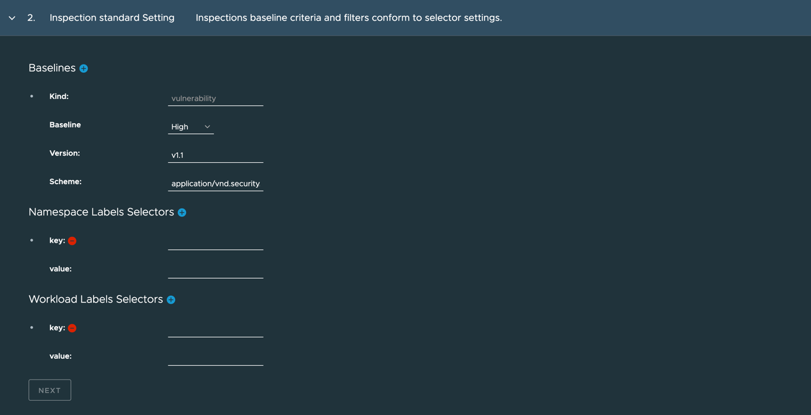

###### Baselines
| Field Name | Field Type | Description                              |
|------------|------------|------------------------------------------|
| Baseline   | string     | Baseline for the compliance of this kind |

###### Namespace Labels Selectors
NamespaceSelector is to specify which namespaces should be scanned


###### Workload Labels Selectors
NamespaceSelector is to specify which workloads should be scanned

  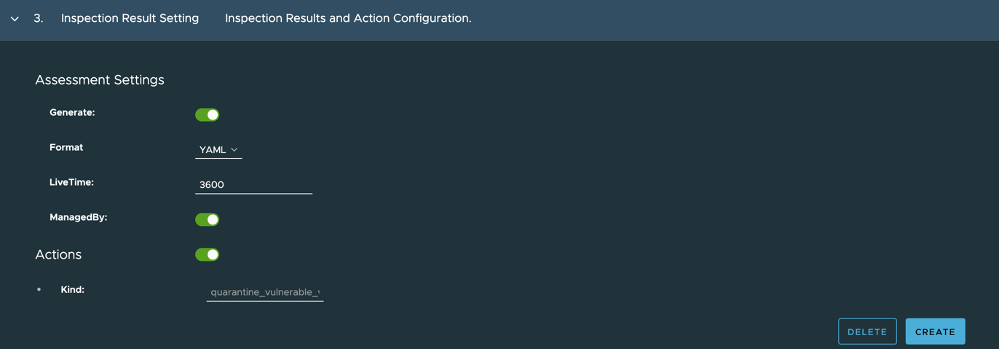

###### Assessment Settings

You can choose whether the assessment reports are generated after each scanning. In additional to that, you can config the format and live time of the reports.

| Field Name      | Field Type | Description                                                                       |
|-----------------|------------|-----------------------------------------------------------------------------------|
| Generate report | bool       | Generate indicates whether generate the assessment report or not, default is true |
| LiveTime        | int64      | Live time of the generated report, the unit is second                             |


###### Actions
If violations are found by the scanning, you can choose if quarantine the workloads that have the vulnerabilities.

| Field Name | Field Type | Description                                                           |
|------------|------------|-----------------------------------------------------------------------|
| Kind       | string     | Kind of action. Now the only choice is quarantine_vulnerable_workload |

 
  4.  After the inspection policy created, inspection scanning will be triggered according to your configuration.  You can navigate to assessments menu to see the security posture and risk trends of the cluster.
#### 1.1.2 Assessments
  A line chart will be generated based on the latest 10 assessment reports.

  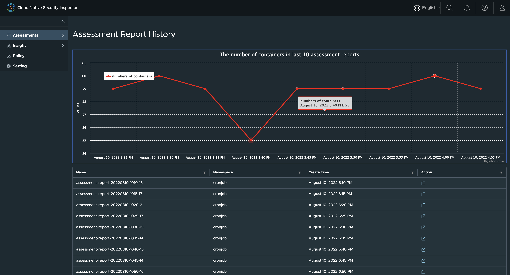
  By clicking the button in action column of each report, you can view the details of the report.
  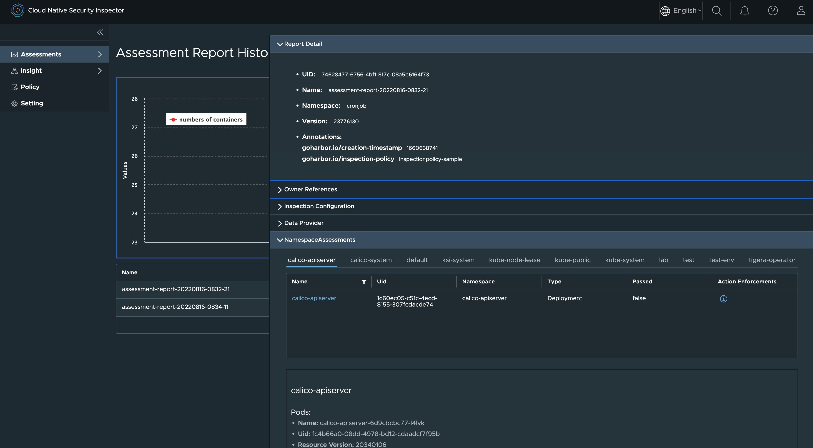

#### 1.1.3 Insight
In insight menu, the security information is clustered by different aspects to help the security auditor know the security posture clearly. 
##### Cluster
  Security data gathered by cluster.
  

  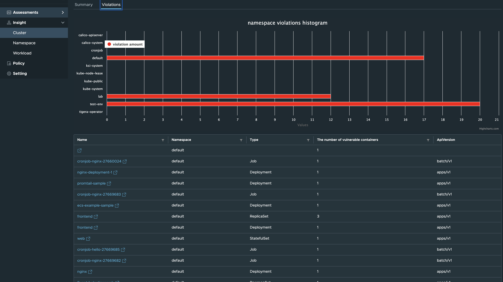

##### Namespace
  Security data gathered by namespace.
    
    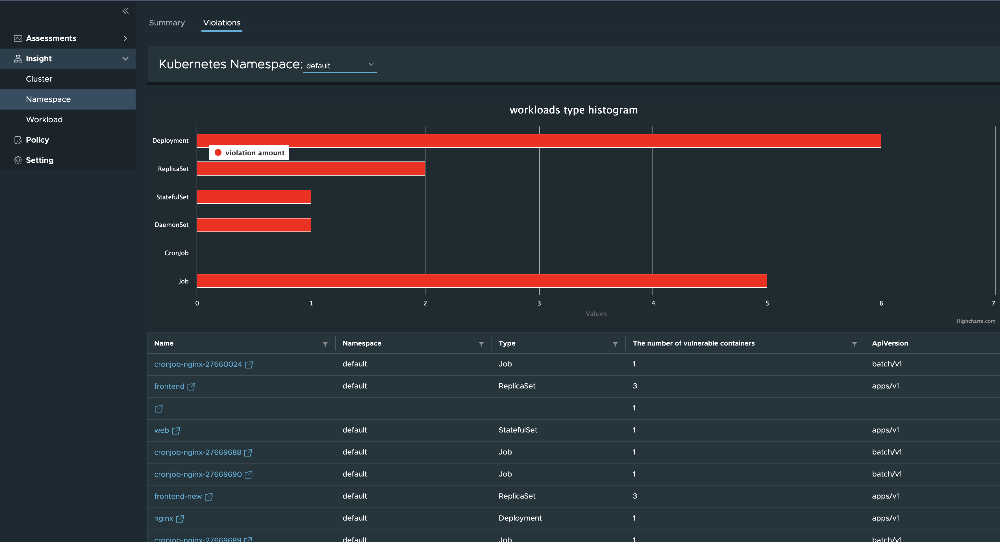

##### Workload
  Displays all the workload that have been scanned by the inspector.
    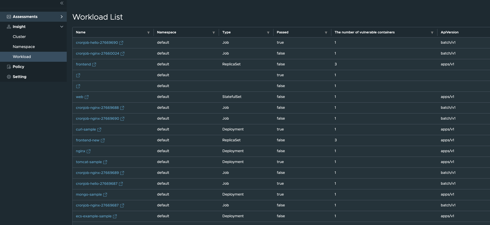

  Click the workload's name to view the details.
    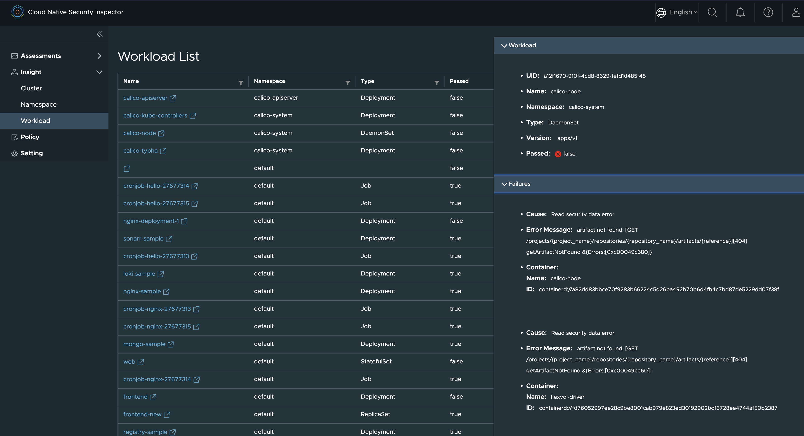

### 1.2 With CLI
#### 1.2.1 Settings
Firstly you need to create the settings of Cloud Native Security Inspector.
```shell
$ cd src/config/samples
$ vim goharbor_v1alpha1_setting.yaml
```

```yaml
apiVersion: v1
data:
  accessKey: YWRtaW4=
  accessSecret: SGFyYm9yMTIzNDU=
kind: Secret
metadata:
  name: harbor
  namespace: default
type: Opaque

---
apiVersion: goharbor.goharbor.io/v1alpha1
kind: Setting
metadata:
  name: sample-setting
spec:
  dataSource:
    credentialRef:
      name: harbor
      namespace: default
    provider: Harbor
    name: source-harbor
    endpoint: https://demo.goharbor.io
    scanSchedule: "0 0 0 * * *"
    skipTLSVerify: false

  knownRegistries:
  - provider: docker-registry
    name: local-registry
    endpoint: https://10.0.0.1:5000
    credentialRef:
      name: harbor
      namespace: default
    skipTLSVerify: true
```

You should define an Opaque secret that has accessKey and accessSecret fields in the
data property, the value of accessKey is the base64 encoded harbor username and the
value of accessSecret is the base64 encoded harbor password.


knowRegistries field is optional when your cluster workloads images are managed
in the data source harbor, otherwise, you need to configure your private
registries here used for harbor replication. You can update the yaml file like below to define a
Harbor(https://10.78.177.224) as the data source:
<details>
  <summary>Example Setting</summary>

```yaml
apiVersion: v1
data:
  accessKey: YWRtaW4=
  accessSecret: SGFyYm9yMTIzNDU=
kind: Secret
metadata:
  name: harbor
  namespace: default
type: Opaque

---
apiVersion: goharbor.goharbor.io/v1alpha1
kind: Setting
metadata:
  name: sample-setting
spec:
  dataSource:
    credentialRef:
      name: harbor
      namespace: default
    provider: Harbor
    name: source-harbor
    endpoint: https://10.78.177.224
    scanSchedule: "0 0 0 * * *"
    skipTLSVerify: true
```
</details>


Then apply this yaml file using kubectl.

```shell
$ kubectl apply -f goharbor_v1alpha1_setting.yaml
```

Using this command to check the status of the setting, ensure the "STATUS" is "Healthy"

```shell
$ kubectl get settings.goharbor.goharbor.io -A

NAME             ENDPOINT                STATUS    AGE
sample-setting   https://10.78.177.224   Healthy   97s
```

#### 1.2.2 Policy

Then users need to create inspection policies to define their security requirements.

```yaml
apiVersion: goharbor.goharbor.io/v1alpha1
kind: InspectionPolicy
metadata:
  name: inspectionpolicy-sample
spec:
  settingsName: "sample-setting"
  enabled: true
  workNamespace: cronjobs
  schedule: "*/1 * * * *"
  strategy:
    historyLimit: 5
    suspend: false
    concurrencyRule: "Forbid"
  inspector:
    image: projects.registry.vmware.com/cnsi/inspector:0.1
    imagePullPolicy: IfNotPresent
  inspection:
    namespaceSelector:
      matchLabels:
        goharbor.io/watch: "true"
    assessment:
      generate: true
      format: "YAML"
      liveTime: 3600
      managedBy: true
    baselines:
      - kind: "vulnerability"
        baseline: "High"
        version: "v1.1"
        scheme: "application/vnd.security.vulnerability.report; version=1.1"
    actions:
      - kind: "quarantine_vulnerable_workload"
```

```shell
$ kubectl create ns cronjobs
$ kubectl label ns workload goharbor.io/watch="true"
$ kubectl apply -f goharbor_v1alpha1_inspectionpolicy.yaml
```
##### 1.2.2.1 Actions
If the `actions` field is not specified, no action will be performed on violation workloads. The following actions are supported by policies.
- quarantine_vulnerable_workload

  For now, Cloud-Native-Security-Inspector supports only `quarantine_vulnerable_workload` type action. 
  
  When violation is detected on workloads, Cloud-Native-Security-Inspector will create a network policy with "deny-all" rules for the namespace if not exist. The violation pods will be labeled `goharbor.io/controller: "TSI"` and `goharbor.io/inspection: "risk'` to match the pod selector on network policy and the pods will be quarantined.

  When the violation pods turns good, the labels will be removed from the pods. And the quarantine will be revoked.

- TBD

  More actions will be supported in the future.
#### 1.2.3 Assessment report
After the InspectionPolicy has been applied, you can find a cronjob will be generated:
```
$ kubectl get cronjob -A
NAMESPACE   NAME                           SCHEDULE      SUSPEND   ACTIVE   LAST SCHEDULE   AGE
cronjobs    inspectionpolicy-samplekbnpq   */1 * * * *   False     0        36s             77s
```

The value of "LAST SCHEDULE" represents if the job has been triggered.
If the job has already been executed, an assessment report will be generated by the scan. You can check the assessment report.


```shell
$ kubectl get assessmentreport -A
cronjobs    assessment-report-20220815-1613-01   3m47s
cronjobs    assessment-report-20220815-1614-01   2m47s
cronjobs    assessment-report-20220815-1615-01   107s
cronjobs    assessment-report-20220815-1616-01   47s

```

```shell
$ kubectl get assessmentreport -n cronjobs    assessment-report-20220815-1613-01  -oyaml
```
<details>
  <summary>Example AssessmentReport</summary>

```yaml
apiVersion: goharbor.goharbor.io/v1alpha1
kind: AssessmentReport
metadata:
  annotations:
    goharbor.io/creation-timestamp: "1660579981"
    goharbor.io/inspection-policy: inspectionpolicy-sample
  creationTimestamp: "2022-08-15T16:13:01Z"
  generation: 1
  name: assessment-report-20220815-1613-01
  namespace: cronjobs
  ownerReferences:
  - apiVersion: goharbor.goharbor.io/v1alpha1
    blockOwnerDeletion: true
    controller: true
    kind: InspectionPolicy
    name: inspectionpolicy-sample
    uid: d4e5b0da-92b9-4869-b7a8-5de789bb750a
  resourceVersion: "1853517"
  uid: dee499e0-fe2e-4893-b75c-b2ad9221fe3b
spec:
  inspectionConfiguration:
    actions:
    - kind: quarantine_vulnerable_workload
    assessment:
      format: YAML
      generate: true
      liveTime: 3600
      managedBy: true
    baselines:
    - baseline: High
      kind: vulnerability
      scheme: application/vnd.security.vulnerability.report; version=1.1
      version: v1.1
    namespaceSelector:
      matchLabels:
        goharbor.io/watch: "true"
  namespaceAssessments:
  - namespace:
      name: workload
    workloadAssessments:
    - passed: true
      workload:
        metadata:
          apiVersion: apps/v1
          kind: Deployment
          name: mongo-sample
          namespace: workload
          uid: 0969e78b-b2d1-4e0c-89fc-dafcfeb03ad3
        pods:
        - containers:
          - id: containerd://3d3baffb19c7254bf7506668d32b9cfdb32601349bf30373ce305793444e26d6
            image: tsi-harbor.com/tsi/mongo:4.2.8
            imageID: tsi-harbor.com/tsi/mongo@sha256:14468b12f721906390c118a38c33caf218c089b751b2f205b2567f99716ae1e9
            isInit: false
            name: mongo
          metadata:
            apiVersion: v1
            kind: Pod
            name: mongo-sample-5f74f65857-s78cg
            namespace: workload
            resourceVersion: "1603282"
            uid: 78db9642-6f49-416f-a5ca-77ef2d3eac51
    - passed: true
      workload:
        metadata:
          apiVersion: apps/v1
          kind: Deployment
          name: nginx-sample
          namespace: workload
          uid: fcdcecf6-a260-4027-bf81-c21e27e02819
        pods:
        - containers:
          - id: containerd://d96d753d1299d74f3a9ab615afd6c893e684eb1f1ec063953acdaa48ab3fd5cc
            image: tsi-harbor.com/tsi/mongo:4.2.8
            imageID: tsi-harbor.com/tsi/mongo@sha256:14468b12f721906390c118a38c33caf218c089b751b2f205b2567f99716ae1e9
            isInit: false
            name: nginx
          metadata:
            apiVersion: v1
            kind: Pod
            name: nginx-sample-7dbcf874cd-bvsl5
            namespace: workload
            resourceVersion: "1603283"
            uid: 8b698433-7afd-4206-a5ce-3c1e8b8e4bf7
    - passed: true
      workload:
        metadata:
          apiVersion: apps/v1
          kind: Deployment
          name: nginx-sample-zzzz
          namespace: workload
          uid: c57ef745-1a24-4672-b833-36490f011aa2
        pods:
        - containers:
          - id: containerd://cb9c5bf08c2301b7f8b9a54d93a9b765548e0b5b4f296b511615d365bb2ec4f2
            image: 10.78.177.224/tsi/mongo:4.2.8
            imageID: 10.78.177.224/tsi/mongo@sha256:14468b12f721906390c118a38c33caf218c089b751b2f205b2567f99716ae1e9
            isInit: false
            name: nginx
          metadata:
            apiVersion: v1
            kind: Pod
            name: nginx-sample-zzzz-5c9d76488c-fzqgn
            namespace: workload
            resourceVersion: "1602942"
            uid: a438bc75-dd84-4027-b64b-f637f860b8da
    - actionEnforcements:
      - action:
          kind: quarantine_vulnerable_workload
        result:
          status: applied
      failures:
      - assessmentError:
          cause: Compliance check failed
          error: expect vulnerability severity <= High but got Critical
        baseline:
          baseline: High
          kind: vulnerability
          scheme: application/vnd.security.vulnerability.report; version=1.1
          version: v1.1
        container:
          id: containerd://c320fde90dc9c74734c34a6fabadb0d841224e10b269e9dc86523a1bf0aa92ea
          image: tsi-harbor.com/tsi/zookeeper:3.8.0
          imageID: tsi-harbor.com/tsi/zookeeper@sha256:7699553f4e6df82c52c246bed60970dc4a96a91fdcea8a27a638d6a8444ff0af
          isInit: false
          name: zookeeper
      passed: false
      workload:
        metadata:
          apiVersion: apps/v1
          kind: Deployment
          name: zookeeper-sample
          namespace: workload
          uid: 35f8518b-4b8b-4f8f-bd59-a573efd50f69
        pods:
        - containers:
          - id: containerd://c320fde90dc9c74734c34a6fabadb0d841224e10b269e9dc86523a1bf0aa92ea
            image: tsi-harbor.com/tsi/zookeeper:3.8.0
            imageID: tsi-harbor.com/tsi/zookeeper@sha256:7699553f4e6df82c52c246bed60970dc4a96a91fdcea8a27a638d6a8444ff0af
            isInit: false
            name: zookeeper
          metadata:
            apiVersion: v1
            kind: Pod
            name: zookeeper-sample-8586d648b4-v6nk5
            namespace: workload
            resourceVersion: "1700139"
            uid: feecbb61-9632-45f4-b9e3-9da3537c35cf
```
</details>


## 2. Troubleshooting
### 2.1 Build portal from scratch
If you encounter the problem of installing npm dependencies during the portal building process,
please modify the npm reference source in Dockerfile.portal

  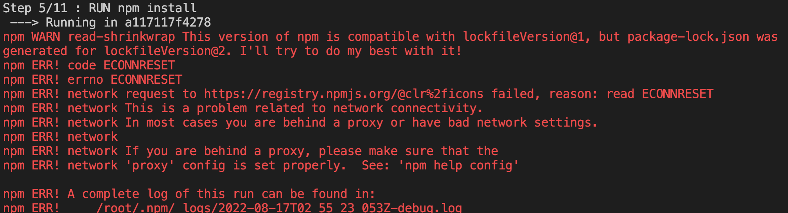

```shell
$ npm --registry https://registry.npm.taobao.org install
  
```