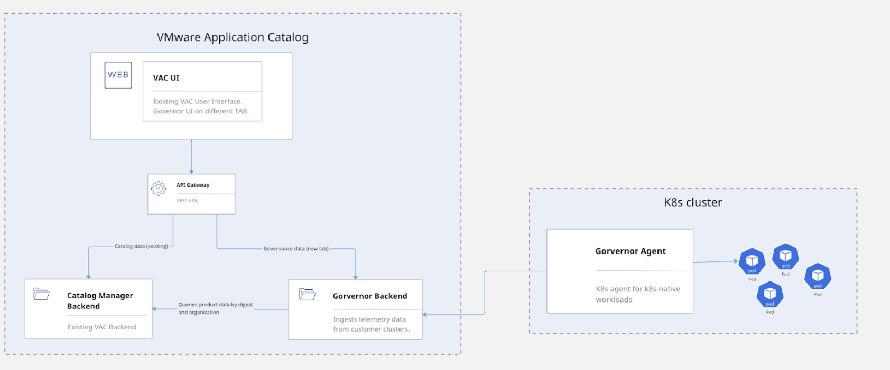

# Open-Source Software Inspection with VMware Application Catalog (EXPERIMENTAL)

Project Narrows can be integrated with VMware Application Catalog (VAC) to enable inspection use cases related to Open-Source Software (OSS) management and governance.

## About VMware Application Catalog

[VMware Application Catalog](https://tanzu.vmware.com/application-catalog) is a customizable selection of trusted, pre-packaged application components that are continuously maintained and verifiably tested for use in production environments. These images are built on custom base operating system images and deposited into a private repository. Every artifact has a complete set of metadata that proves the trustworthiness of the software within, easily accessible through a centralized UI. VAC is an enterprise offering from VMware built on top of the [Bitnami](https://www.bitnami.com) ecosystem.

## Open-Source Software Inspection

Integration with VAC opens several OSS inspection use cases for this Cloud-Native Security Inspector (CNSI). Example scenarios could be:

- Detect, flag and/or prevent in certain namespaces the use of OSS solutions that haven't been curated by a trusted provider. Users of CNSI and VAC can create policies that react when certain namespaces contain workloads that are unknown and haven't been provisioned through a VAC registry. An example could be an engineering team that provisioned a MariaDB database that had been pulled from a non-trusted registry at DockerHub. Pulling software from untrusted arbitrary providers can become an important security risk for corporations of any size.

- Detect OSS workloads that are using deprecated versions of Open-Source. An example is an NGINX 1.21 deployment running in production unnoticed to corporate IT or platform teams and that has gone End-of-Life (EOL) months ago. EOL'ed software is very difficult to detect and an important liability as not only won't have official support but also might not be patched for security fixes by upstream providers. The ability to detect deprecated OSS is a very attractive use case for corporations.

- Advanced OSS upgrade policies. Kubernetes [offers some very basic](https://kubernetes.io/docs/concepts/containers/images/#image-pull-policy) support for auto-upgrade policies which is pretty much limited to updating either always or never. Many teams find this quite limiting. Combining CNSI and VAC could provide support for smarter OSS upgrade policies like for example upgrading when certain vulnerabilities have been detected, upgrading based on upstream releases to patch/minor/major versions, or perhaps using custom specific user-driven logic. 

## Architecture
    

Integration with VAC is very straightforward. VAC is a SaaS product and as long as you have access to it either via a trial or an official license then you will be able to link your CNSI inspection policy to the VAC governor backend. From that moment, CNSI will start delivering inspection assessment data to VAC and will be using the VAC Governor component to detect trusted software, deprecations and any other governance capability implemented over time. 

## Disclaimer
When using the Governor component with CNSI and VAC, assessment report telemetry data is sent to VMware. If you don't will to send any data to our systems then you should avoid turning on the Governance capability.

## 2 Minutes Setup
To Be Done
