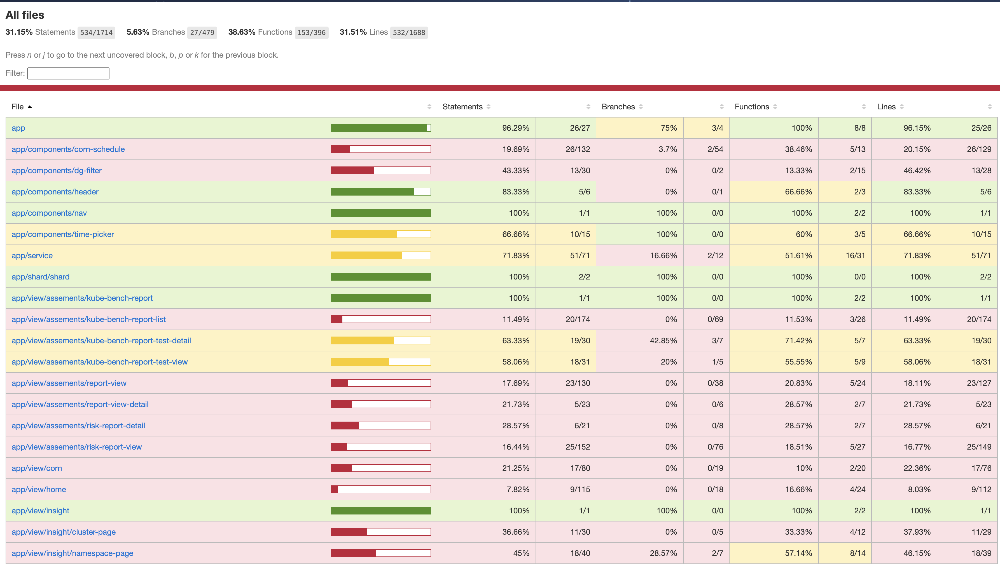

# Cloud Native Security Inspector Front-End Developer Testing Guide
This is a project based on Jasmine and Karma for unit testing and Cypress e2e for testing the front end.

Unit test
============

1. [Jasmine](https://jasmine.github.io/tutorials/your_first_suite) learns to use official documents.

2.  [Angular Testing](https://angular.io/guide/testing) Learning Documentation。

3. When modifying components or creating new ones, synchronous unit testing of newly added code is required. The test code can be carried out according to the [policy component](../src/frontend/src/app/view/policy/policy.component.spec.ts) below.

```ts
describe('PolicyComponent', () => {
  // The test content needs to be written into the modified function
  let component: PolicyComponent;
  let fixture: ComponentFixture<PolicyComponent>;
  let policyService: PolicyService
  // Define the results that the test needs to return in advance
  const policyServiceStub = {
    getInspectionpolicies() {
      return of<InspectionPolicyType>({apiVersion: '',
        items: [],
        kind: '',
        metadata: {
          continue: '',
          remainingItemCount: 0,
          resourceVersion: '',
          selfLink: ''
        }});
    },
  }
  // Inject the involved classes into the test unit, and instantiate
  beforeEach(async () => {
    await TestBed.configureTestingModule({
      declarations: [ PolicyComponent ],
      imports: [ShardTestModule, RouterTestingModule],
      providers: [PolicyService],
      schemas: [CUSTOM_ELEMENTS_SCHEMA, NO_ERRORS_SCHEMA]
    })
    .compileComponents();

    fixture = TestBed.createComponent(PolicyComponent);
    component = fixture.componentInstance;
    fixture.detectChanges();
  });

  // Add the corresponding test code according to the newly added code
  describe('getInspectionpolicies()', () => {
    it('get inspectionpolicies', () => {
      component.modifyPolicy()
      component.deleteModalHandler('test')
      component.deletePolicy()
  
    });

    it('getInspectionpolicies', fakeAsync(() => {
      spyOn(policyService, 'getInspectionpolicies').and.returnValue(
        policyServiceStub.getInspectionpolicies()
      );
      component.getInspectionpolicies();
      fixture.detectChanges();
      expect(policyService.getInspectionpolicies).toHaveBeenCalled();
      tick(1500);
      expect(policyService.getInspectionpolicies);
    }));
  });
});

```
4. After the unit test code is completed, open the src/frontend terminal under the Cloud Native Security Inspector project directory
```bash
$ cd src/frontend 

$ npm run test

```
5. You can view the test coverage of each file by modifying [karma.conf.js](../src/frontend/karma.conf.js) as follows。

```js
    coverageReporter: {
      type: 'html',  // view via browser
      ...
    },
    ...
    singleRun: false, // Set singleRun to false to view via browser

```

6. Go to src/frontend/coverage/lcov-report under the Cloud Native Security Inspector project directory through Finder, and open index.html through a browser to view the test coverage of each file.



e2e test
============
1. [Cypress](https://docs.cypress.io/api/commands/and) learning and using official documents

2. When modifying or creating a new UI page, it is necessary to perform synchronous automated testing on the newly added code. The test code can follow the [policy.cy.ts](../src/frontend/cypress/e2e/policy.cy.ts) below.

```ts
describe('Setting Test', () => {
  beforeEach(() => {
    Cypress.on('uncaught:exception', (err, runnable) => {
      // returning false here prevents Cypress from
      // failing the test
      return false
    })
    // mock API
    cy.intercept('GET', environment.api.goharbor + '/inspectionpolicies', { fixture: 'policy.json' })
    cy.intercept('GET', '/proxy/apis/goharbor.goharbor.io/v1alpha1/settings', { fixture: 'settings.json' })
    cy.intercept('POST', environment.api.goharbor + '/inspectionpolicies', {
      statusCode: 201,
      body: {
        msg: 'created sussessful!',
      },
    })
    // The page route ready to load
    cy.visit('http://localhost:4004/policy')
  })


  it('new policy', () => {
    // create policy
    cy.intercept('GET', environment.api.goharbor + '/inspectionpolicies', { fixture: 'policy-list.json' })
    // return policy create
    cy.visit('http://localhost:4004/modify-policy/create')
    // Populate page data
    cy.get('[data-cy=name]').type('policy-test', {force: true})
    cy.get('[data-cy=namespace]').type('cronjobs', {force: true})
    cy.get('[data-cy=imagePullPolicy]').select('Always')
    cy.get('[data-cy=settingsName]').select('sample-setting')


    cy.get('[data-cy=next-one]').click()
    cy.get('[data-cy=policySettingAddItem]').click()  
    
    cy.get('[data-cy=key]').type('default', {force: true})
    cy.get('[data-cy=value]').type('true', {force: true})

    cy.get('[data-cy=next-two]').click()

    // create policy
    cy.get('[data-cy=created]').click()
    
  })

})

```

3. After the e2e test code is completed, open the src/frontend terminal under the Cloud Native Security Inspector project directory
```bash
$ cd src/frontend 

# View the test results directly on the terminal
$ npm run cypress:run
#  or
# View the test process and test results through the browser
$ npm run cypress:open

```