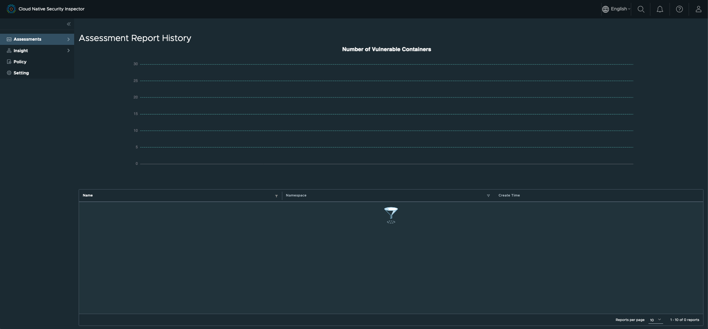
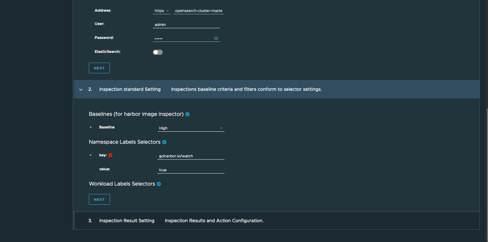
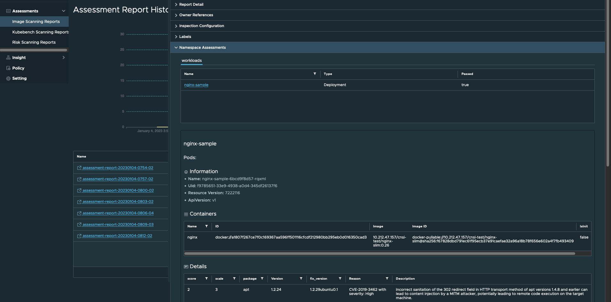
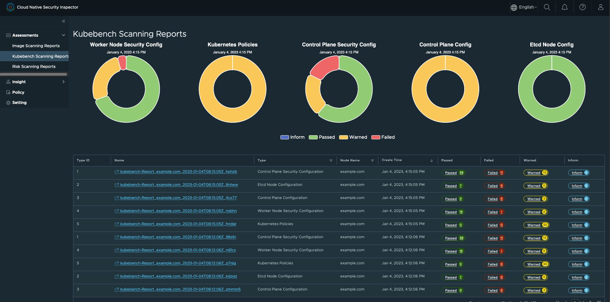
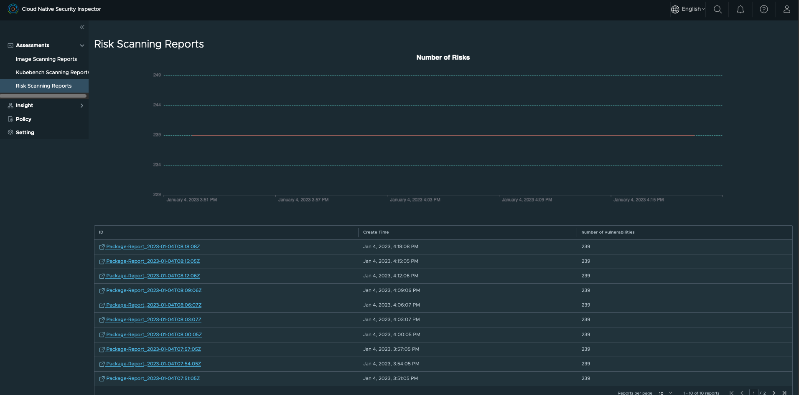
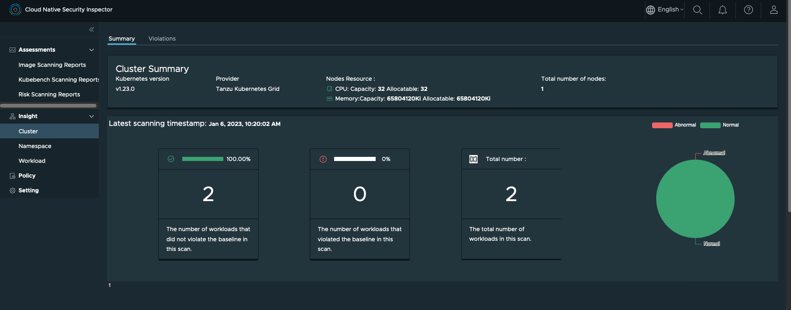
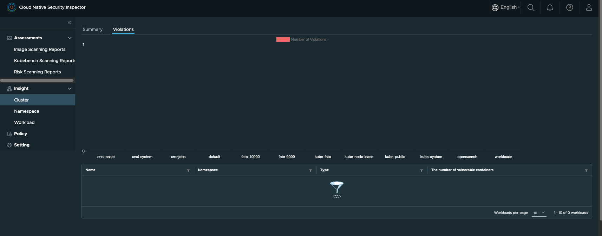

# Tutorial
In this tutorial, we will from scratch to install a MiniKube for Kubernetes and deploy Narrows on it. We will install a Nginx workload for demo purpose, and use Narrows to scan the vulnerability of this Nginx workload.

## Prerequisite
* A Linux machine. The verified OS is CentOS Linux release 7.9.2009 (Core).
* The demo machine has a 32-core CPU, 64G memory.
* Docker has been installed on the Linux machine. Reference: [Install Docker in CentOS7] (https://www.digitalocean.com/community/tutorials/how-to-install-and-use-docker-on-centos-7)
* You need to have a [Harbor](https://goharbor.io/) 2.5.0+ instance and [vulnerability scanning in Harbor](https://goharbor.io/docs/main/administration/vulnerability-scanning/) is configured properly

## Prepare a K8s cluster

There are many ways to deploy a K8s cluster, we choose Minikube in this tutorial.
Run below 3 commands for installing kubectl, minikube and start the 1-node K8s cluster:
```
curl -LO https://storage.googleapis.com/kubernetes-release/release/v1.23.0/bin/linux/amd64/kubectl && chmod +x ./kubectl && sudo mv ./kubectl /usr/bin
curl -LO https://github.com/kubernetes/minikube/releases/download/v1.23.0/minikube-linux-amd64 && mv minikube-linux-amd64 minikube && chmod +x minikube && sudo mv ./minikube /usr/bin
sudo minikube start --vm-driver=none --kubernetes-version v1.23.0
```
Verification:
```
➜  ~ kubectl get pods -A
NAMESPACE     NAME                                                      READY   STATUS    RESTARTS   AGE
kube-system   coredns-64897985d-nl4wx                                   1/1     Running   0          9m37s
kube-system   etcd-control-plane.minikube.internal                      1/1     Running   0          9m49s
kube-system   kube-apiserver-control-plane.minikube.internal            1/1     Running   0          9m51s
kube-system   kube-controller-manager-control-plane.minikube.internal   1/1     Running   0          9m49s
kube-system   kube-proxy-6vrff                                          1/1     Running   0          9m37s
kube-system   kube-scheduler-control-plane.minikube.internal            1/1     Running   0          9m49s
kube-system   storage-provisioner                                       1/1     Running   0          9m48s
```

## Deploy Narrows on the K8s cluster

### Install the dependencies
```
yum -y install git wget gcc
wget https://get.helm.sh/helm-v3.9.0-linux-amd64.tar.gz
tar -zxvf helm-v3.9.0-linux-amd64.tar.gz
mv linux-amd64/helm /usr/local/bin/helm
```
### Install Narrows
```
git clone https://github.com/vmware-tanzu/cloud-native-security-inspector.git
cd cloud-native-security-inspector
./deploy.sh install
```
The `./deploy.sh install` command will help you install an Opensearch service by helm.
Opensearch is used to store the assessment reports. Currently Narrows supports using [Open Search](https://opensearch.org/) and
[Elastic Search](https://www.elastic.co/) to store assessment reports. 

The user is responsible for preparing Opensearch or Elasticsearch. The one installed by deploy.sh
is for POC purpose.

After that, put the endpoint of the report consumer in the policy, then the Exporter component of Narrows is able to forward the report to the consumer.

Verification:

```
➜  ~  kubectl get all -n cnsi-system
NAME                                                          READY   STATUS    RESTARTS   AGE
pod/cloud-native-security-inspector-portal-7b4fb65c59-q6frt   1/1     Running   0          2m20s
pod/cnsi-controller-manager-5586dcc798-zpq78                  2/2     Running   0          2m19s
pod/cnsi-exporter-69c786c9f-4xtsf                             1/1     Running   0          2m18s

NAME                                                     TYPE        CLUSTER-IP       EXTERNAL-IP   PORT(S)          AGE
service/cloud-native-security-inspector-portal-service   NodePort    10.99.242.121    <none>        3800:30150/TCP   2m19s
service/cnsi-controller-manager-metrics-service          ClusterIP   10.109.123.209   <none>        8443/TCP         2m19s
service/cnsi-exporter-service                            ClusterIP   10.100.148.44    <none>        6780/TCP         2m18s

NAME                                                     READY   UP-TO-DATE   AVAILABLE   AGE
deployment.apps/cloud-native-security-inspector-portal   1/1     1            1           2m20s
deployment.apps/cnsi-controller-manager                  1/1     1            1           2m19s
deployment.apps/cnsi-exporter                            1/1     1            1           2m18s

NAME                                                                DESIRED   CURRENT   READY   AGE
replicaset.apps/cloud-native-security-inspector-portal-7b4fb65c59   1         1         1       2m20s
replicaset.apps/cnsi-controller-manager-5586dcc798                  1         1         1       2m19s
replicaset.apps/cnsi-exporter-69c786c9f                             1         1         1       2m18s
```

Now you are able to access the Narrows portal by clusterIp:30150, because the portal is a NodePort service.
```
service/cloud-native-security-inspector-portal-service   NodePort    10.99.242.121    <none>        3800:30150/TCP   2m19s
```

Verify the OpenSearch service is deployed properly:
```
➜  ~  kubectl get all -n opensearch
NAME                                                              READY   STATUS    RESTARTS   AGE
pod/opensearch-cluster-master-0                                   1/1     Running   0          3m26s
pod/opensearch-cluster-master-1                                   1/1     Running   0          3m26s
pod/opensearch-cluster-master-2                                   1/1     Running   0          3m26s

NAME                                                 TYPE        CLUSTER-IP       EXTERNAL-IP   PORT(S)             AGE
service/opensearch-cluster-master                    ClusterIP   10.105.148.154   <none>        9200/TCP,9300/TCP   3m26s
service/opensearch-cluster-master-headless           ClusterIP   None             <none>        9200/TCP,9300/TCP   3m26s

NAME                                         READY   AGE
statefulset.apps/opensearch-cluster-master   3/3     3m26s
```
The in-cluster OpenSearch endpoint is `opensearch-cluster-master.opensearch:9200`.

Later, we will set this OpenSearch endpoint in policy.

## Inspect the workload with CNSI
### Create a Setting
Now type `<your_node_ip>:30150` on the browser of your laptop (which must have
network access to your CentOS node). You will see the Portal UI:


However, the UI is empty for now, you need to start from the Setting and the Policy.

The concept of Setting in CNSI is basically a configuration CRD that points CNSI
to the Harbor instance that will be used to serve vulnerability scanning results.
The secret essentially contains the admin access credentials to that Harbor instance.
TLS verification needs to be skipped as everything is running in private certs.

Now set the secrets of the harbor instance:


A new Secret Type is added to the UI. Because we embed VAC (VMware Application Catalog View), we need to distinguish the secrets of harbor and VAC, so that we can use the secret later. Here we need to select harbor.

You need to change the access key and secret to your **admin's** account.

Then create a new Setting:

Remember to change the Harbor endpoint to yours.

In the second section "Known Registries", you can configure docker.io as a registry.
This is the ace feature of Harbor: as a image cache for any registry. Check more
details [here](https://goharbor.io/docs/2.3.0/administration/configuring-replication/).

Then verify that the setting is in healthy status:


### Create a Workload which will be inspected

We create a prometheus workload to inspect:
```
helm install my-release bitnami/kube-prometheus -n prometheus --create-namespace
```


Verification:
```
➜  ~  kubectl get all -n prometheus
NAME                                                                READY   STATUS    RESTARTS   AGE
pod/alertmanager-my-release-kube-prometheus-alertmanager-0          2/2     Running   1          25m
pod/my-release-kube-prometheus-blackbox-exporter-56d78b857b-nsvmp   1/1     Running   0          25m
pod/my-release-kube-prometheus-operator-85dfdb86dd-xn9j9            1/1     Running   0          25m
pod/my-release-kube-state-metrics-77846699c6-52rrg                  1/1     Running   0          25m
pod/my-release-node-exporter-7thxl                                  1/1     Running   0          25m
pod/prometheus-my-release-kube-prometheus-prometheus-0              2/2     Running   0          25m

NAME                                                   TYPE        CLUSTER-IP       EXTERNAL-IP   PORT(S)                      AGE
service/alertmanager-operated                          ClusterIP   None             <none>        9093/TCP,9094/TCP,9094/UDP   25m
service/my-release-kube-prometheus-alertmanager        ClusterIP   10.97.136.59     <none>        9093/TCP                     25m
service/my-release-kube-prometheus-blackbox-exporter   ClusterIP   10.98.0.24       <none>        19115/TCP                    25m
service/my-release-kube-prometheus-operator            ClusterIP   10.104.91.120    <none>        8080/TCP                     25m
service/my-release-kube-prometheus-prometheus          ClusterIP   10.97.199.150    <none>        9090/TCP                     25m
service/my-release-kube-state-metrics                  ClusterIP   10.100.110.196   <none>        8080/TCP                     25m
service/my-release-node-exporter                       ClusterIP   10.104.50.246    <none>        9100/TCP                     25m
service/prometheus-operated                            ClusterIP   None             <none>        9090/TCP                     25m

NAME                                      DESIRED   CURRENT   READY   UP-TO-DATE   AVAILABLE   NODE SELECTOR   AGE
daemonset.apps/my-release-node-exporter   1         1         1       1            1           <none>          25m

NAME                                                           READY   UP-TO-DATE   AVAILABLE   AGE
deployment.apps/my-release-kube-prometheus-blackbox-exporter   1/1     1            1           25m
deployment.apps/my-release-kube-prometheus-operator            1/1     1            1           25m
deployment.apps/my-release-kube-state-metrics                  1/1     1            1           25m

NAME                                                                      DESIRED   CURRENT   READY   AGE
replicaset.apps/my-release-kube-prometheus-blackbox-exporter-56d78b857b   1         1         1       25m
replicaset.apps/my-release-kube-prometheus-operator-85dfdb86dd            1         1         1       25m
replicaset.apps/my-release-kube-state-metrics-77846699c6                  1         1         1       25m

NAME                                                                    READY   AGE
statefulset.apps/alertmanager-my-release-kube-prometheus-alertmanager   1/1     25m
statefulset.apps/prometheus-my-release-kube-prometheus-prometheus       1/1     25m
```

### Create a Policy
The Narrows Policy defines 3 things:
1. The scanners to be used.
2. The frequency of the scanning.
3. The consumers of the reports.


We selected all the 3 supported scanners and configured the open search endpoint.

In the next section, we set the label of the prometheus namespace.



Then click next and click create button to create the policy.

After the policy is created, the scanner workloads will be provisioned to scan the
namespace `prometheus`.

```
➜  ~  kubectl get all -n cronjobs
09:26:59 root@example cloud-native-security-inspector ±|develop-0-3|→ kubectl get all -n narrows-workspace
NAME                                             READY   STATUS      RESTARTS   AGE
pod/demo-policy-kubebench-daemonset-5gfgh        1/1     Running     0          12m
pod/demo-policy7fqsb--inspector-27970719-q69qh   0/1     Completed   0          2m22s
pod/demo-policydxjxs--risk-27970719-fdt6w        0/2     Completed   0          2m22s

NAME                                             DESIRED   CURRENT   READY   UP-TO-DATE   AVAILABLE   NODE SELECTOR   AGE
daemonset.apps/demo-policy-kubebench-daemonset   1         1         1       1            1           <none>          12m

NAME                                        SCHEDULE      SUSPEND   ACTIVE   LAST SCHEDULE   AGE
cronjob.batch/demo-policy7fqsb--inspector   */3 * * * *   False     0        2m22s           12m
cronjob.batch/demo-policydxjxs--risk        */3 * * * *   False     0        2m22s           12m

NAME                                             COMPLETIONS   DURATION   AGE
job.batch/demo-policy7fqsb--inspector-27970719   1/1           19s        2m22s
job.batch/demo-policydxjxs--risk-27970719        1/1           57s        2m22s
```

For Narrows 0.3, the image scanner and the risk scanner are triggered by CronJob.
The Kubebench scanner is in the form of DaemonSet.
Image scanner will dynamically monitor the security posture of the images.
For Kubebench scanner, it is triggered by events: when there are modifications in the K8s config files,
this scanner will be triggered to scan the configuration security issues immediately.

### Check the assessment reports
We can check the assessment reports generated by the 3 scanners.

#### Image scanning reports
We can check the trend of the vulnerabilities discovered by the Image vulnerability scanner.


Click the buttons under the "Action" column can navigate you to the details of a certain report:



#### Kubebench scanning reports
We can check the Kubebench reports of a certain node.



Click a certain report under the "Name" column to check the details of a certain report:


The report is categorized into several different kinds, you can click one of them to check the further details:


#### Risk scanning reports

We can check the Risk reports:



We can check the report under the "ID" column to check the details of a certain report:


#### Pkgload scanning reports

We can check the pkg with vulnerabilities which affect running processes discovered by the Pkgload scanner.

WIP 

For the detailed explanation of the reports, please check [User Guide](USER-GUIDE.md).

### Check the insights

We support inspecting the insights from 3 different perspectives, in release 0.3 the insight functionality only covers the image scanner.

#### cluster perspective





#### namespace perspective


#### workload perspective


For the detailed explanation of the insights, please check [User Guide](USER-GUIDE.md).
