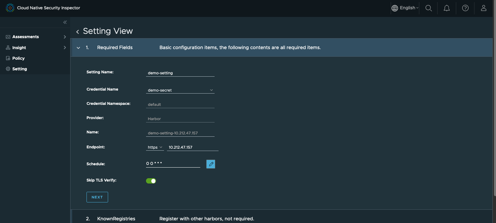
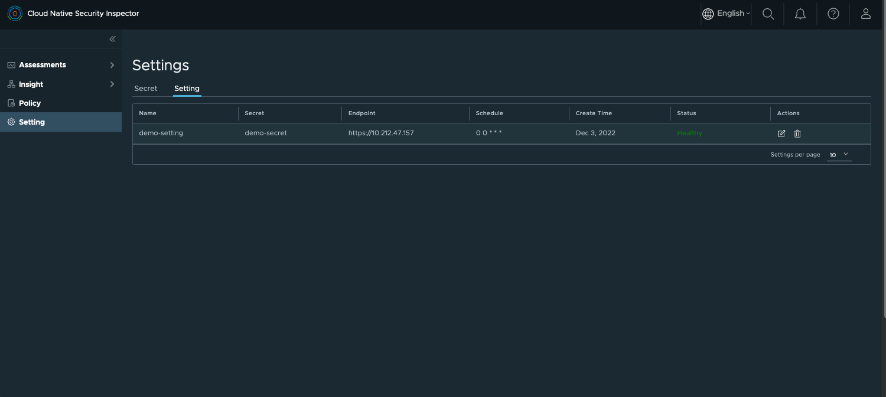
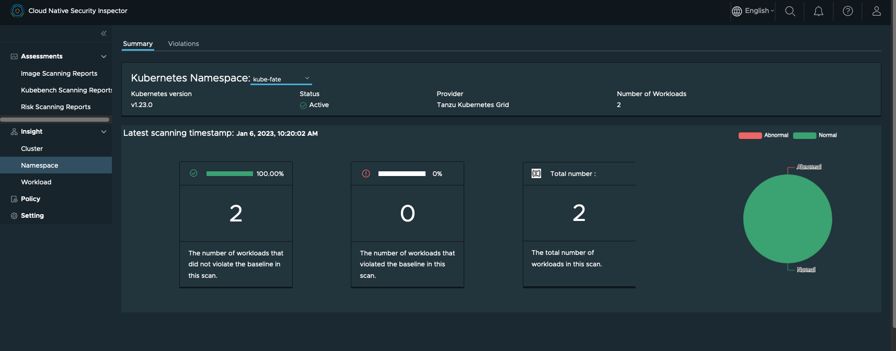
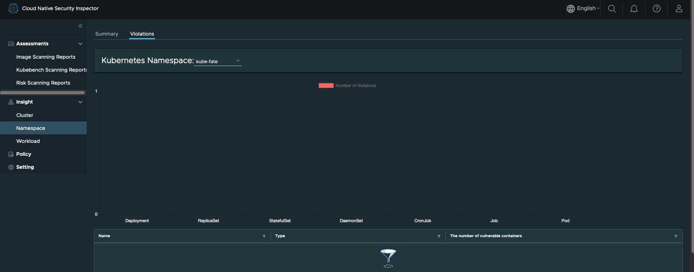

# Tutorial
In this tutorial, we will from scratch to install a MiniKube for Kubernetes
and deploy the cloud native security inspector (CNSI) on it. We will install a
Nginx workload for demo purpose, and use CNSI to scan the vulnerability of this
Nginx workload.

## Prerequisite
* A Linux machine. The verified OS is CentOS Linux release 7.9.2009 (Core).
* The demo machine has a 32-core CPU, 64G memory.
* Docker has been installed on the Linux machine. Reference: [Install Docker in CentOS7] (https://www.digitalocean.com/community/tutorials/how-to-install-and-use-docker-on-centos-7)
* You need to have a [Harbor](https://goharbor.io/) 2.5.0+ instance and [vulnerability scanning in Harbor](https://goharbor.io/docs/main/administration/vulnerability-scanning/) is configured properly

## Prepare a K8s cluster

There are many ways to deploy a K8s cluster, we choose Minikube in this tutorial.
Run below 3 commands for installing kubectl, minikube and start the 1-node K8s cluster:
```
curl -LO https://storage.googleapis.com/kubernetes-release/release/v1.23.0/bin/linux/amd64/kubectl && chmod +x ./kubectl && sudo mv ./kubectl /usr/bin
curl -LO https://github.com/kubernetes/minikube/releases/download/v1.23.0/minikube-linux-amd64 && mv minikube-linux-amd64 minikube && chmod +x minikube && sudo mv ./minikube /usr/bin
sudo minikube start --vm-driver=none --kubernetes-version v1.23.0
```
Verification:
```
➜  ~ kubectl get pods -A
NAMESPACE     NAME                                                      READY   STATUS    RESTARTS   AGE
kube-system   coredns-64897985d-nl4wx                                   1/1     Running   0          9m37s
kube-system   etcd-control-plane.minikube.internal                      1/1     Running   0          9m49s
kube-system   kube-apiserver-control-plane.minikube.internal            1/1     Running   0          9m51s
kube-system   kube-controller-manager-control-plane.minikube.internal   1/1     Running   0          9m49s
kube-system   kube-proxy-6vrff                                          1/1     Running   0          9m37s
kube-system   kube-scheduler-control-plane.minikube.internal            1/1     Running   0          9m49s
kube-system   storage-provisioner                                       1/1     Running   0          9m48s
```

## Deploy CNSI on the K8s cluster

### Install the dependencies
```
yum -y install git wget gcc
wget https://get.helm.sh/helm-v3.9.0-linux-amd64.tar.gz
tar -zxvf helm-v3.9.0-linux-amd64.tar.gz
mv linux-amd64/helm /usr/local/bin/helm
```
### Install CNSI
```
git clone https://github.com/vmware-tanzu/cloud-native-security-inspector.git
cd cloud-native-security-inspector
./deploy.sh install
```
The `./deploy.sh install` command will help you install an Opensearch service by helm.
Opensearch is used to store the assessment reports. CNSI supports using [Open Search](https://opensearch.org/) and
[Elastic Search](https://www.elastic.co/) to store the assessment reports.

The user is responsible for preparing Opensearch or Elasticsearch. The one installed by deploy.sh
is for POC purpose.

Verification:

```
➜  ~  kubectl get all -n cnsi-system
NAME                                                          READY   STATUS    RESTARTS   AGE
pod/cloud-native-security-inspector-portal-6656444dd5-nx5x5   1/1     Running   0          20h
pod/cnsi-controller-manager-7c756fd8d8-lhk85                  2/2     Running   0          7m13s

NAME                                                     TYPE        CLUSTER-IP      EXTERNAL-IP   PORT(S)          AGE
service/cloud-native-security-inspector-portal-service   NodePort    10.107.70.236   <none>        3800:30150/TCP   20h
service/cnsi-controller-manager-metrics-service          ClusterIP   10.101.31.8     <none>        8443/TCP         7m13s

NAME                                                     READY   UP-TO-DATE   AVAILABLE   AGE
deployment.apps/cloud-native-security-inspector-portal   1/1     1            1           20h
deployment.apps/cnsi-controller-manager                  1/1     1            1           7m13s

NAME                                                                DESIRED   CURRENT   READY   AGE
replicaset.apps/cloud-native-security-inspector-portal-6656444dd5   1         1         1       20h
replicaset.apps/cnsi-controller-manager-7c756fd8d8                  1         1         1       7m13s
```

Now you are able to access the CNSI portal through clusterIp:30150, because the portal is a NodePort service.

Now verify the OpenSearch service is deployed properly:
```
➜  ~  kubectl get all -n opensearch
NAME                              READY   STATUS    RESTARTS   AGE
pod/opensearch-cluster-master-0   1/1     Running   0          119s
pod/opensearch-cluster-master-1   1/1     Running   0          119s
pod/opensearch-cluster-master-2   1/1     Running   0          119s

NAME                                         TYPE        CLUSTER-IP     EXTERNAL-IP   PORT(S)             AGE
service/opensearch-cluster-master            ClusterIP   10.108.254.0   <none>        9200/TCP,9300/TCP   11m
service/opensearch-cluster-master-headless   ClusterIP   None           <none>        9200/TCP,9300/TCP   11m

NAME                                         READY   AGE
statefulset.apps/opensearch-cluster-master   3/3     11m
```
The OpenSearch endpoint is `opensearch-cluster-master.opensearch:9200`.

We will configure this OpenSearch endpoint in the CNSI's portal.

## Inspect the workload with CNSI
### Create a Setting
Now type `<your_node_ip>:30150` on the browser of your laptop (which must have
network access to your CentOS node). You will see the CNSI portal UI:


However, the UI is empty for now, you need to start from the Setting and the Policy.

The concept of Setting in CNSI is basically a configuration CRD that points CNSI
to the Harbor instance that will be used to serve vulnerability scanning results.
The secret essentially contains the admin access credentials to that Harbor instance.
TLS verification needs to be skipped as everything is running in private certs.

Now set the secrets of the harbor instance:


You need to change the access key and secret to your **admin's** account.

Then create a new Setting:

Remember to change the Harbor endpoint to yours.

Then verify that the setting is in healthy status:



### Create a Workload which will be inspected

For demo purpose, we create a nginx workload.

```
cat <<EOF | kubectl apply -f -
apiVersion: v1
kind: Namespace
metadata:
  name: workloads
  labels:
    goharbor.io/watch: "true"
---
apiVersion: v1
kind: Secret
metadata:
  name: regcred
  namespace: workloads
data:
  .dockerconfigjson: eyJhdXRocyI6eyIxMC4yMTIuNDcuMTU3Ijp7InVzZXJuYW1lIjoiYWRtaW4iLCJwYXNzd29yZCI6IkhhcmJvcjEyMzQ1IiwiYXV0aCI6IllXUnRhVzQ2U0dGeVltOXlNVEl6TkRVPSJ9fX0=
type: kubernetes.io/dockerconfigjson
---
apiVersion: apps/v1
kind: Deployment
metadata:
  name: nginx-sample
  namespace: workloads
  labels:
    app: nginx
spec:
  replicas: 1
  selector:
    matchLabels:
      app: nginx
  template:
    metadata:
      labels:
        app: nginx
    spec:
      containers:
        - name: nginx
          image: <your harbor instance>/nginx-slim:0.26
          ports:
            - containerPort: 80
      imagePullSecrets:
        - name: regcred
EOF
```
This image should be from your harbor instance.

Verification:
```
➜  ~  kubectl get all -n workloads
NAME                                READY   STATUS    RESTARTS   AGE
pod/nginx-sample-6bcd9f8d57-crx9s   1/1     Running   0          17s

NAME                           READY   UP-TO-DATE   AVAILABLE   AGE
deployment.apps/nginx-sample   1/1     1            1           17s

NAME                                      DESIRED   CURRENT   READY   AGE
replicaset.apps/nginx-sample-6bcd9f8d57   1         1         1       17s
```

### Create a Policy for inspection
The CNSI Policy defines 3 things:
1. Which scanner will be used to scan which namespace or workload.
2. The scanning will be conducted by what frequency.
3. Where to export the assessment results.


We selected all the 3 supported scanners and configured the open search endpoint.
Then click "next" until the policy is created.

Creating this policy also means creating cronjobs in the work namespace.
```
➜  ~  kubectl get all -n cronjobs
NAME                                             READY   STATUS      RESTARTS   AGE
pod/demo-policygfmnf--inspector-27834141-l2b6p   0/1     Completed   0          12m
pod/demo-policygfmnf--inspector-27834144-q5hm7   0/1     Completed   0          9m47s
pod/demo-policygfmnf--inspector-27834147-ls67v   0/1     Completed   0          6m47s
pod/demo-policygfmnf--inspector-27834150-rkvrv   0/1     Completed   0          3m47s
pod/demo-policygfmnf--inspector-27834153-l4vk5   0/1     Completed   0          47s
pod/demo-policynf8nh--kubebench-27834141-hx47c   0/1     Completed   0          12m
pod/demo-policynf8nh--kubebench-27834144-r6j9j   0/1     Completed   0          9m47s
pod/demo-policynf8nh--kubebench-27834147-dcp9j   0/1     Completed   0          6m47s
pod/demo-policynf8nh--kubebench-27834150-t4d6j   0/1     Completed   0          3m47s
pod/demo-policynf8nh--kubebench-27834153-gkllz   0/1     Completed   0          47s
pod/demo-policyp5lrl--risk-27834141-8qssz        0/2     Completed   0          12m
pod/demo-policyp5lrl--risk-27834144-v62q7        0/2     Completed   0          9m47s
pod/demo-policyp5lrl--risk-27834147-c6pzj        0/2     Completed   0          6m47s
pod/demo-policyp5lrl--risk-27834150-kkqmk        0/2     Completed   0          3m47s
pod/demo-policyp5lrl--risk-27834153-g2rsc        0/2     Completed   0          47s

NAME                                        SCHEDULE      SUSPEND   ACTIVE   LAST SCHEDULE   AGE
cronjob.batch/demo-policygfmnf--inspector   */3 * * * *   False     0        47s             61m
cronjob.batch/demo-policynf8nh--kubebench   */3 * * * *   False     0        47s             61m
cronjob.batch/demo-policyp5lrl--risk        */3 * * * *   False     0        47s             61m

NAME                                             COMPLETIONS   DURATION   AGE
job.batch/demo-policygfmnf--inspector-27834141   1/1           3s         12m
job.batch/demo-policygfmnf--inspector-27834144   1/1           2s         9m47s
job.batch/demo-policygfmnf--inspector-27834147   1/1           2s         6m47s
job.batch/demo-policygfmnf--inspector-27834150   1/1           3s         3m47s
job.batch/demo-policygfmnf--inspector-27834153   1/1           2s         47s
job.batch/demo-policynf8nh--kubebench-27834141   1/1           4s         12m
job.batch/demo-policynf8nh--kubebench-27834144   1/1           2s         9m47s
job.batch/demo-policynf8nh--kubebench-27834147   1/1           2s         6m47s
job.batch/demo-policynf8nh--kubebench-27834150   1/1           4s         3m47s
job.batch/demo-policynf8nh--kubebench-27834153   1/1           2s         47s
job.batch/demo-policyp5lrl--risk-27834141        1/1           39s        12m
job.batch/demo-policyp5lrl--risk-27834144        1/1           38s        9m47s
job.batch/demo-policyp5lrl--risk-27834147        1/1           38s        6m47s
job.batch/demo-policyp5lrl--risk-27834150        1/1           39s        3m47s
job.batch/demo-policyp5lrl--risk-27834153        1/1           38s        47s
```
As `historyLimit` is specified to 5, we can check at most 5 historical cronjobs of each scanner.

We will find that assessment reports are generated as well:
```
➜  ~ kubectl get assessmentreport -n cronjobs
NAME                                 AGE
assessment-report-20221203-0536-02   58m
assessment-report-20221203-0539-02   55m
...
assessment-report-20221203-0633-01   97s
```

### Check the assessment reports
We can check the assessment reports generated by the 3 scanners/

#### Image scanning reports
We can check the time series trend of the vulnerabilities discovered by the Image vulnerability scanner.


Click the buttons under the "Action" column can navigate you to the details of a certain report:


#### Kubebench scanning reports
We can check the Kubebench reports:


Click a certain report under the "Name" column to check the details of a certain report:


The report is categorized into several different kinds, you can click one of them to check the further details:


#### Risk scanning reports

We can check the Risk reports:


We can check the report under the "ID" column to check the details of a certain report:


For the detailed explanation of the reports, please check [User Guide](USER-GUIDE.md).

### Check the insights

We support inspecting the insights from 3 different perspectives, in release 0.2 the insight functionality only covers the image scanner.

#### cluster perspective


#### namespace perspective





#### workload perspective


For the detailed explanation of the insights, please check [User Guide](USER-GUIDE.md).
