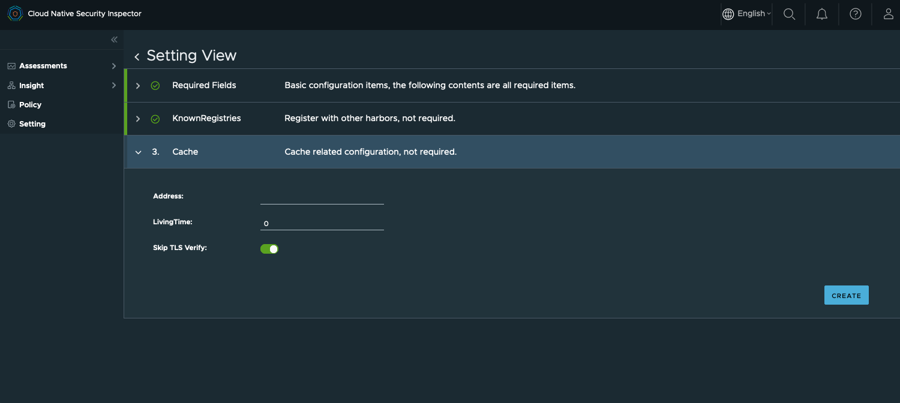
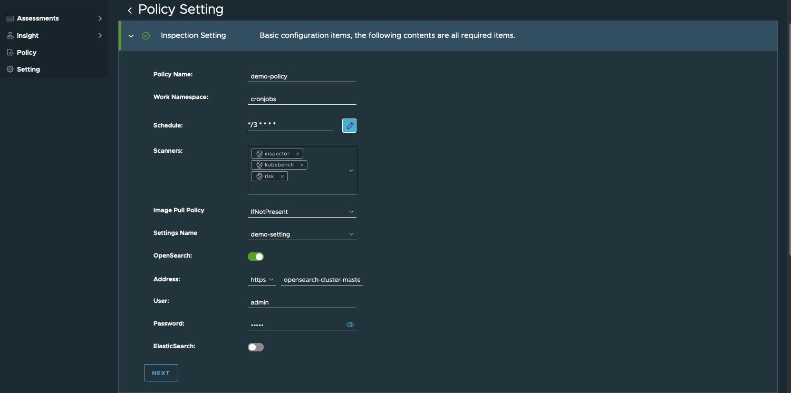
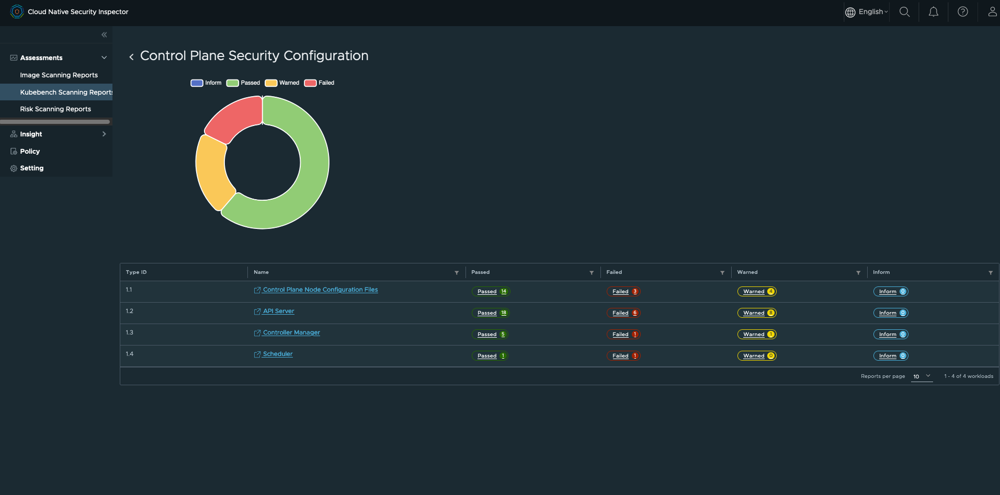
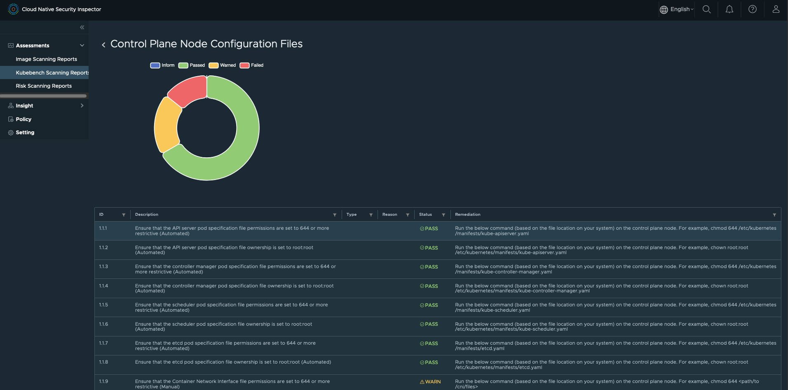
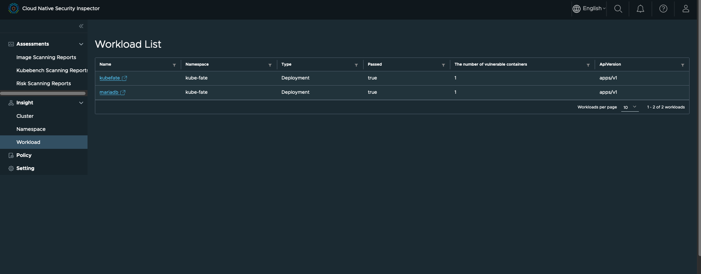

# User Guide
  - [1. To start using Cloud Native Security Inspector](#1-to-start-using-cloud-native-security-inspector-cnsi)
    - [1.1 With portal (recommended)](#11-with-portal-recommended)
      - [1.1.1 Configurations](#111-configurations)
        - [Secret](#secret)
        - [Setting](#setting)
          - [DataSource](#datasource)
          - [KnownRegistry](#knownregistry)
          - [Cache](#cache)
        - [Policy](#policy)
          - [Inspection Settings](#inspection-settings)
          - [Baselines](#baselines)
          - [Namespace Labels Selectors](#namespace-labels-selectors)
          - [Workload Labels Selectors](#workload-labels-selectors)
          - [Assessment Settings](#assessment-settings)
          - [Actions](#actions)
      - [1.1.2 Assessments](#112-assessments)
        - [Image scanning reports](#image-scanning-reports)
        - [Kubebench scanning reports](#kubebench-scanning-reports)
        - [Risk scanning reports](#risk-scanning-reports)
      - [1.1.3 Insight](#113-insight)
        - [Cluster](#cluster)
        - [Namespace](#namespace)
        - [Workload](#workload)
    - [1.2 With CLI](#12-with-cli)
      - [1.2.1 Settings](#121-settings)
      - [1.2.2 Policy](#122-policy)
        - [1.2.2.1 Actions](#1221-actions)
      - [1.2.3 Assessment report](#123-assessment-report)
  - [2. Troubleshooting](#2-troubleshooting)
    - [2.1 With portal](#21-build-portal-from-scratch)
----

## 1. To start using Cloud Native Security Inspector (CNSI)
### 1.1 With portal (recommended)
#### 1.1.1 Configurations

Currently, we need one Secret, one setting and one Policy to be configured, then CNSI can work properly.

###### Secret
Create a secret for Harbor so that Cloud-Native-Security-Inspector can talk to Harbor with the credentials.

For release 0.2.0, Harbor is mandatory for the image scanner and risk scanner, CNSI depends on the vulnerability report
of the images.

The secret you created will be referred by the setting. If you have already had the K8s secret, you can skip creating one and move forward to next step.


| Field Name    | Type   | Description            |
|---------------|--------|------------------------|
| accessKey     | string | The username of Harbor |
| accessSecret  | string | The password of Harbor |
| Name          | string | The secret's name      |
| Namespace     | string | The secret's namespace |

##### Setting
Click on "Credential Name" and choose the secret you've created in the previous step. 
You also need to specify the endpoint of Harbor and schedule for Harbor for updating the CVE reports.


###### Required Fields

| Field Name           | Field Type  | Description                                                                       |
|----------------------|-------------|-----------------------------------------------------------------------------------|
| Setting Name         | string      | The name of the data source                                                       |
| Credential Name      | string      | The name of the credential of data source                                         |
| Credential Namespace | string      | The namespace of the credential of data source                                    |
| Provider             | string      | The provider of the data source, currently only support Harbor                    |
| Name                 | string      | The name of the datasource setting, auto-generated and can't be modified          |
| Endpoint             | URL(string) | The endpoint of the data source                                                   |
| Schedule             | string      | The cron expression to be configured in Harbor to specify the CVE update interval |
| skipTLSVerify        | boolean     | Whether need to skip the TLS verify                                               |


###### Known Registry
This field is optional. If it is configured, replicate rules are set up in Harbor and images from 
the known registries can be automatically replicated to Harbor.

Currently, Harbor support 11 different image registries.
Navigate to this [page](https://goharbor.io/docs/2.5.0/administration/configuring-replication/create-replication-endpoints/) to check the details.


| Field Name           | Field Type  | Description                                      |
|----------------------|-------------|--------------------------------------------------|
| provider             | string      | The provider of the registry                     |
| name                 | string      | The name of the registry                         |
| endpoint             | URL(string) | The endpoint of the registry                     |
| Credential Name      | string      | The name of the credential of KnownRegistry      |
| Credential Namespace | string      | The namespace of the credential of KnownRegistry |
| skipTLSVerify        | boolean     | Whether need to skip the TLS verify              |

###### Cache
This filed is optional. If it is configured. Cloud-Native-Security-Inspector can use the external Redis you specified here to cache the security data from Harbor.



| Field Name    | Field Type  | Description                                                                                              |
|---------------|-------------|----------------------------------------------------------------------------------------------------------|
| address       | URL(string) | The URL of the redis address                                                                             |
| livingTime    | int64       | LivingTime (seconds) specifies the living time of the cache data                                         |
| skipTLSVerify | boolean     | SkipTLSVerify indicates whether skip the TLS verification. Only active when 'redis' scheme is configured |

#### Policy
Once the Setting is done, you can create an inspection policy according to your security requirements.

By defining the inspection policy, users can:
1. Define the schedule for scanning.
2. Choose which scanners are included.
3. Define the baseline of the image scanner, which means that CVE above which baseline should be reported in image scanning reports.
4. Choose the namespace or the workloads to be scanned by the label selector.
5. Define where to export the reports, currently support OpenSearch and ElasticSearch.

In Release 0.2 the obsolete data in OpenSearch or ElasticSearch need to be purged manually,
in the next release we will consider to add a way to purge the data automatically.



###### Inspection Setting
| Field Name      | Field Type        | Description                                                                       |
|-----------------|-------------------|-----------------------------------------------------------------------------------|
| Policy Name     | string            | The name of this policy                                                           |
| Work Namespace  | string            | The namespace for the scanners                                                    |
| Schedule        | string            | Configure Inspection schedule                                                     |
| Scanners        | multiple configs  | The scanners to be included in the policy                                         |
| ImagePullPolicy | corev1.PullPolicy | Image pull policy. Choose from Always, IfNotPresent and Never                     |
| Settings Name   | string            | Select the existing setting's name                                                |
| OpenSearch      | multiple configs  | Enable this to leverage OpenSearch to store the time-series assessment reports    |
| ElasticSearch   | multiple configs  | Enable this to leverage ElasticSearch to store the time-series assessment reports |


###### Inspection standard setting


| Field Name        | Field Type | Description                                                                          |
|-------------------|------------|--------------------------------------------------------------------------------------|
| Baseline          | string     | The CVE issues above which baseline should be included in the image scanning reports |
| NamespaceSelector | map        | The label of the to-be-scanned namespaces                                            |
| NamespaceSelector | map        | The label of the to-be-scanned workloads                                             |

###### Inspection result setting


You can choose whether the image scanner reports are generated in the K8s cluster as CRD after each scanning.
In additional to that, you can config the format and live time of the reports.

These configs are for image scanning report only, and is for 0.2 release. In the next release this part of data
will also be sent to opensearch or elasticsearch, just like what we have done for the Kube-bench scanning reports and
the risk scanning reports.

| Field Name      | Field Type | Description                                                                       |
|-----------------|------------|-----------------------------------------------------------------------------------|
| Generate report | bool       | Generate indicates whether generate the assessment report or not, default is true |
| LiveTime        | int64      | Live time of the generated report, the unit is second                             |
| Kind            | string     | Kind of action. Now the only choice is quarantine_vulnerable_workload             |

After the inspection policy created, scanners will start to work.

You can navigate to `Assessments` to check the security posture and risk trends of the cluster.

#### 1.1.2 Assessments

We can view the reports of the scanners.

##### Image scanning reports
A time-series chart will be generated for the image scanning reports, such as:


By clicking the name of each report, you can view the details of the report.


If there is no CVE items whose severity is higher than the baseline you configured, then
the report will show the number of vulnerable containers is zero. But you can still review
all the CVE items equal or below the baseline in the `Details` section of the report.

##### Kubebench scanning reports
Besides the image scanner scanning the image of the running workloads, the Kubebench scanner
scans the configurations of the underlying K8s cluster.


The checks lie in 5 different categories:
1. Worknode security config
2. Kubernetes policies
3. Control plane security config
4. Control plane config
5. Etcd node config

Each category also contains several sub-categories, example:


Each sub-category contains the actual security check items:


The checks are based on the [CIS Kubernetes Benchmark support](https://www.cisecurity.org/benchmark/kubernetes)

The Kubebench scanner is based on this [opensource implementation](https://github.com/aquasecurity/kube-bench),
we integrate this scanner into Cloud-Native-Security-Inspector. The config files are mounted from
the host to the Kubebench scanner's cronjob pod, then those configuration files are analyzed.

The Kubebench scanner can detect the K8s verison and choose the corresponding baseline file.
Check all the supported baseline files [here](https://github.com/vmware-tanzu/cloud-native-security-inspector/tree/main/src/cmd/kubebench/cfg)

##### Risk scanning reports
This report lists all the pods along with pod name, namespace under which it is running,
as well as the number of vulnerabilities contained in the pod.


In release 0.2 the risk scanner will report 3 kinds of risks:
###### serious vulnerabilities
The report includes the vulnerabilities at least with medium severity. Risk scanner will give
a 3-scaled score for the risks. With Medium as 1, High as 2 and Critical as 3.

The risk scanner will decode the CVE vector of each serious vulnerabilities and find below
2 kinds of further risks.

###### network exposure risks
When the vulnerability's [CVSS v3.1 vector](https://www.first.org/cvss/specification-document) indicates that
this vulnerability could bring more risks when the workload is exposed to the network,
the risk scanner will add a new vulnerability item indicates that.
Example:
```
resource Pod:mariadb-6df76645bf-hvdbj:kube-fate:bade5b13-1538-43e8-8649-7a27e385d74f is
exposed to network while it has vulneratbility CVE-2016-20013(severity: 2) with network exposure
```
The score scale of this kind of risk is 5. With None as 0, Low as 2, Medium as 3, High as 4 and Critical as 5.

The scale for this kind of issue is larger than the `serious vulnerabilities` because the risks become higher
after network exposure.

###### privilege risks
When the vulnerability's CVSS v3.1 vector indicates that this vulnerability could bring more risks 
when the workload has a lower required privilege to be accessed. Then the risk scanner will add a
new vulnerability item to report this potential risk.

The score scale for this kind of risk is the same with the `network exposure risks`.


We can also check the time-series trend of the vulnerabilities in the container.

#### 1.1.3 Insight
In release 2.0, insight is all about the image scanning results, Kubebench scanning results and
risk scanning results are not included in the Insight section.

The security administrator can examine the CVE issues in 3 perspectives:

* Cluster
* Namespace
* Workload

##### Cluster
You can check the total number of workloads that passed or violates the baseline within the cluster CNSI was installed.

You can check the distribution of the vulnerable workloads across the namespaces within the cluster in this perspective.


##### Namespace
You can check the total number of workloads that passed or violates the baseline within a certain namespace.

You can check the distribution of the vulnerable workloads across different types of workload within the namespace.


##### Workload
You can also directly check all the workloads scanned by image scanner, and check their results:


### 1.2 With CLI
#### 1.2.1 Settings
Firstly you need to create the settings of Cloud Native Security Inspector.

Create yaml files such as below examples.
```yaml
apiVersion: v1
data:
  accessKey: YWRtaW4=
  accessSecret: SGFyYm9yMTIzNDU=
kind: Secret
metadata:
  name: harbor
  namespace: default
type: Opaque

---
apiVersion: goharbor.goharbor.io/v1alpha1
kind: Setting
metadata:
  name: sample-setting
spec:
  dataSource:
    credentialRef:
      name: harbor
      namespace: default
    provider: Harbor
    name: source-harbor
    endpoint: https://demo.goharbor.io
    scanSchedule: "0 0 0 * * *"
    skipTLSVerify: false

  knownRegistries:
  - provider: docker-registry
    name: local-registry
    endpoint: https://10.0.0.1:5000
    credentialRef:
      name: harbor
      namespace: default
    skipTLSVerify: true
```

You should define an Opaque secret that has accessKey and accessSecret fields in the
data property, the value of accessKey is the base64 encoded harbor username and the
value of accessSecret is the base64 encoded harbor password.

knowRegistries field is optional when your cluster workloads images are managed
in the data source harbor, otherwise, you need to configure your private
registries here used for harbor replication. You can update the yaml file like below to 
define a Harbor as the data source:

Then apply the yaml file using kubectl.

Using below command to check the status of the setting, make sure the "STATUS" is "Healthy"

```shell
$ kubectl get settings -A

NAME             ENDPOINT                STATUS    AGE
sample-setting   https://10.78.177.224   Healthy   97s
```

#### 1.2.2 Policy

Then users need to create inspection policies to define their security requirements, example yaml:

```yaml
apiVersion: goharbor.goharbor.io/v1alpha1
kind: InspectionPolicy
metadata:
  name: demo-policy
spec:
  enabled: true
  inspector:
    image: projects.registry.vmware.com/cnsi/inspector:0.2
    imagePullPolicy: IfNotPresent
    imagePullSecrets: []
    kubebenchImage: projects.registry.vmware.com/cnsi/kubebench:0.2
    riskImage: projects.registry.vmware.com/cnsi/risk:0.2
  inspection:
    assessment:
      elasticSearchEnabled: false
      format: YAML
      generate: true
      liveTime: 3600
      managedBy: true
      openSearchAddr: https://opensearch-cluster-master.opensearch:9200
      openSearchEnabled: true
      openSearchPasswd: admin
      openSearchUser: admin
    baselines:
      - baseline: High
        kind: vulnerability
        scheme: application/vnd.security.vulnerability.report; version=1.1
        version: v1.1
    namespaceSelector:
      matchLabels:
        goharbor.io/watch: "true"
    actions:
      - kind: quarantine_vulnerable_workload
  schedule: '*/3 * * * *'
  settingsName: sample-setting
  strategy:
    concurrencyRule: Forbid
    historyLimit: 5
    suspend: false
  workNamespace: cronjobs
```

After the policy is created, cronjobs will be created automatically to scan the workloads, based
on the given label selector defined in the policy.

##### 1.2.2.1 Actions
If the `actions` field is not specified, no action will be performed on violation workloads. 
The following actions are supported by policies. 

###### quarantine_vulnerable_workload 

For now, Cloud-Native-Security-Inspector only supports `quarantine_vulnerable_workload` type action. 
  
When violation is detected on workloads, Cloud-Native-Security-Inspector will create a network
policy with "deny-all" rules for the namespace if not exist. The violation pods will be
labeled `goharbor.io/controller: "CNSI"` and `goharbor.io/inspection: "risk'` to match
the pod selector on network policy and the pods will be quarantined.

When the violation pods turns good, the labels will be removed from the pods. And the
quarantine will be revoked.

###### TBD
More actions will be supported in the future.

#### 1.2.3 Assessment report
After the InspectionPolicy has been applied, you can find a cronjob will be generated:
```
$ kubectl get cronjob -A
NAMESPACE   NAME                           SCHEDULE      SUSPEND   ACTIVE   LAST SCHEDULE   AGE
cronjobs    inspectionpolicy-samplekbnpq   */3 * * * *   False     0        36s             77s
```

The value of "LAST SCHEDULE" represents if the job has been triggered.
If the job has already been executed, an assessment report will be generated.
You can list the assessment report.

```shell
➜  ~  kubectl get assessmentreport -A
NAMESPACE   NAME                                 AGE
cronjobs    assessment-report-20221205-0221-03   58m
cronjobs    assessment-report-20221205-0224-01   55m
cronjobs    assessment-report-20221205-0227-02   52m
cronjobs    assessment-report-20221205-0230-02   49m
cronjobs    assessment-report-20221205-0233-01   46m
cronjobs    assessment-report-20221205-0236-01   43m
...
cronjobs    assessment-report-20221205-0318-02   74s
```

You can also check the details of one certain assessment report:

```
➜ ~ kubectl get assessmentreport -n cronjobs assessment-report-20221205-0318-02 -oyaml
```
<details>
  <summary>Example AssessmentReport</summary>

```yaml
apiVersion: goharbor.goharbor.io/v1alpha1
kind: AssessmentReport
metadata:
  annotations:
    goharbor.io/creation-timestamp: "1670210282"
    goharbor.io/inspection-policy: demo-policy
  creationTimestamp: "2022-12-05T03:18:03Z"
  generation: 1
  name: assessment-report-20221205-0318-02
  namespace: cronjobs
  ownerReferences:
    - apiVersion: goharbor.goharbor.io/v1alpha1
      blockOwnerDeletion: true
      controller: true
      kind: InspectionPolicy
      name: demo-policy
      uid: 9d4ab334-02d2-4134-9ffb-20c6d1a0df3c
  resourceVersion: "1341801"
  uid: 1398d2d4-b853-4917-b7d1-5e6b1d5dca36
spec:
  inspectionConfiguration:
    actions:
      - ignore: {}
        kind: quarantine_vulnerable_workload
    assessment:
      elasticSearchAddr: ""
      elasticSearchCert: ""
      elasticSearchEnabled: false
      elasticSearchPasswd: ""
      elasticSearchUser: ""
      format: YAML
      generate: true
      liveTime: 3600
      managedBy: true
      openSearchAddr: https://opensearch-cluster-master.opensearch:9200
      openSearchCert: ""
      openSearchEnabled: true
      openSearchPasswd: admin
      openSearchUser: admin
    baselines:
      - baseline: High
        kind: vulnerability
        scheme: application/vnd.security.vulnerability.report; version=1.1
        version: v1.1
    namespaceSelector:
      matchLabels:
        goharbor.io/watch: "true"
    workloadSelector: {}
  namespaceAssessments:
    - namespace:
        name: workloads
      workloadAssessments:
        - passed: true
          workload:
            metadata:
              apiVersion: apps/v1
              kind: Deployment
              name: nginx-sample
              namespace: workloads
              uid: 4dcf0f46-4fbb-4c01-ae84-ea67fe592c6e
            pods:
              - containers:
                  - id: docker://08ab9e795f23eb21ceddb4c19300a7229f1e59348bd7d5c769ea587a8f885a52
                    image: 10.212.47.157/cnsi-test/nginx-slim:0.26
                    imageID: docker-pullable://10.212.47.157/cnsi-test/nginx-slim@sha256:f67828dbd791ec61f95ecb37e91caefae32a96a18b78f656e602a4f7fb493409
                    isInit: false
                    name: nginx
                metadata:
                  apiVersion: v1
                  kind: Pod
                  name: nginx-sample-6bcd9f8d57-crx9s
                  namespace: workloads
                  resourceVersion: "391681"
                  uid: 5a362921-ab0a-47c7-b05b-e57203ff20c7
```
</details>


## 2. Troubleshooting
### 2.1 Build portal from scratch
If you encounter the problem of installing npm dependencies during the portal building process,
please modify the npm reference source in Dockerfile.portal

  

```shell
$ npm --registry https://registry.npm.taobao.org install
```