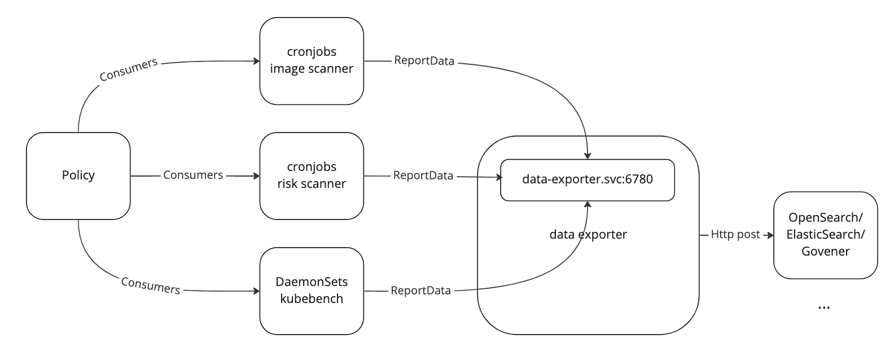
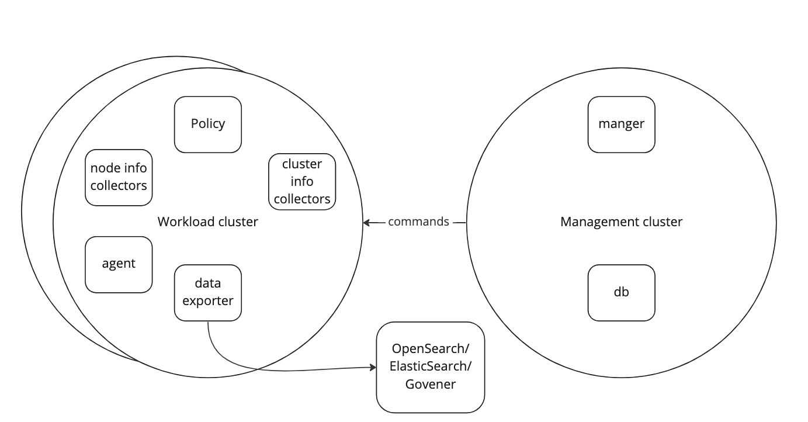

# Data Exporter Phase 1

## Abstract
We are going to add a component called data exporter, who defines a protocol and holds an endpoint.
Any scanner obeying the protocol can send the data to the endpoint. Then the data exporter can help
to send the data to anywhere.

## Background
### Problem Statement

Currently, in each scanner's code, we have coupling functionalities:

The scanners need not only to scan, define the report struct, but also need to
handle the connection to the consumers, such as Opensearch. This will cause a problem:

* When a developer needs to integrate a new scanner, this person needs to write the
code about how this new scanner send the report to every consumer.
* When a developer needs to support a new consumer, this person needs to write the
code about how to send each scanner's report to this new consumer.

Above 2 problems prevent Narrows to be an extensible project. This is why we want to
decouple scanner and the client of the consumers.

### Proposal

We are going to have another deployment of pods called Data-Exporter in Narrows.
This new component, has the extensible capability to forward the report from any
scanner to any consumer.

With Data-Exporter, a scanner just need to:
* Generate the report data as a json-formatted string.
* Still get the consumer information from the policy.
* Seal above contents into a struct based on the protocol.
* Call the endpoint of Data-Exporter.

After that, when a new scanner is added into Narrows, it just need to care about how to send data to
data exporter.

When a new consumer is added into Narrows, it just need to extent some code of data exporter.
We can mark the places where the code should be changed and provide docs to make it easy.

## Goals
* Install a deployment of data exporter when user installs Narrows.
* Make the current 3 scanners to call the endpoint to send the report.
* Define the protocol between the scanners and the data exporter.
* The data exporter should have no aware of the detailed mapping of the report.

## None-Goals at phase 1
* Split this data exporter to resource collector, db, analyst and the phase-2 data exporter.
* Eliminate the Cronjob scanners.

## High-Level Design

### Single cluster



* The scanners will keep reading the consumer information from the policy.
* The scanners will keep generate the report, they define the struct of their reports and marshal to json.
* The cluster id, node id, and the scanner's name will be a part of the report.
* The ReportData is the protocol between scanner and the exporter, it contains two parts of data:
  * The consumers of the report.
  * The report payloads.
* The exporter is a deployment with an internal service in the K8s cluster, exposed by port 6780.
* The exporter will unwrap the ReportData, get the config, and forward the payload based on the config.

The protocol:
```go
type Configuration struct {
	OpenSearch         OpensearchOutputConfig `json:"openSearch,omitempty"`
	// Extend this struct for more consumers
}

type OpensearchOutputConfig struct {
	HostPort  string `json:"host_port"`
	Index     string `json:"index"`
	Username  string `json:"username"`
	Password  string `json:"password"`
	CheckCert bool   `json:"checkCert"`
	MutualTLS bool   `json:"mutualTLS"`
}

type ReportData struct {
	Config  Configuration `json:"config"`
	Payload string        `json:"payload"`
}
```

### Multi cluster




## Detailed Design
### Main function
```go
func main() {
	http.HandleFunc("/forward", mainHandler)
	listenPort := 6780
	log.Infof("data exporter is up and listening on port %d", listenPort)
	if err := http.ListenAndServe(fmt.Sprintf("%s:%d", "", listenPort), nil); err != nil {
		log.Fatalf("failed to start the data exporter server")
	}
}
```

### The Main handler
```go
func mainHandler(w http.ResponseWriter, r *http.Request) {
	/*
	   error handle
	*/
	forwardEvent(reportData)
}
```

### The forwardEvent function
```go
func forwardEvent(reportData *types.ReportData) {
	config := reportData.Config
	if config.OpenSearch.HostPort != "" {
		osEndpoint := fmt.Sprintf("%s/%s/_doc", config.OpenSearch.HostPort, config.OpenSearch.Index)
		OpensearchClient, err := outputs.NewClient(
			osEndpoint, config.OpenSearch.MutualTLS, config.OpenSearch.CheckCert, &config)
        go OpensearchClient.OpenSearchPost(reportData.Payload)
	}
	if config.xxx.port != "" {}   
	// ...
}
```

### The post function for openSearch
```go
// OpenSearchPost posts event to OpenSearch
func (c *Client) OpenSearchPost(payloadStr string) {
	if c.Config.OpenSearch.Username != "" && c.Config.OpenSearch.Password != "" {
		c.BasicAuth(c.Config.OpenSearch.Username, c.Config.OpenSearch.Password)
	}
	err := c.Post(payloadStr)
	if err != nil {
        // error handle
	}
}
```

### The general Client struct and Post function
Take [this](https://github.com/falcosecurity/falcosidekick/blob/master/outputs/client.go) as a reference:
