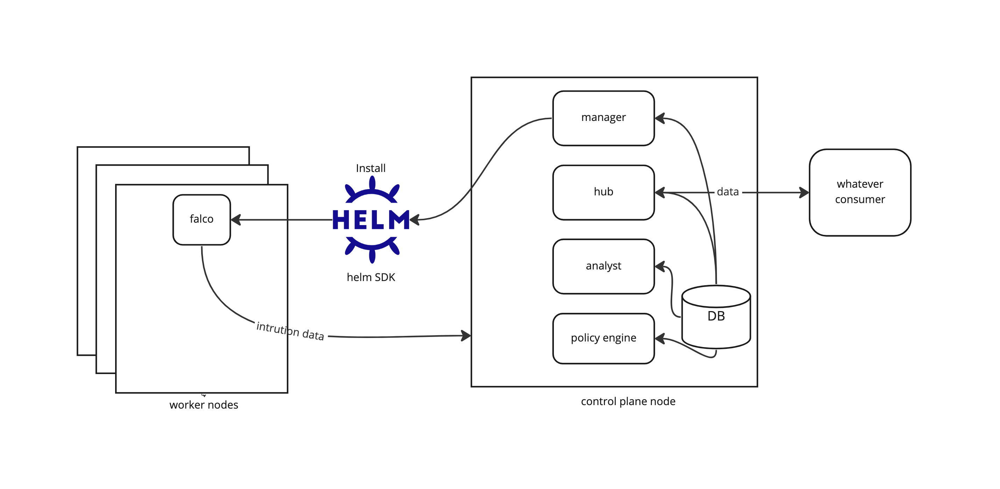

# Integrate Falco into CNSI

## Abstract
We want to integrate Falco into CNSI, to provide dynamical intrusion detection for
the workload pods.

## Background
In release 0.2 CNSI still does not have the capability of dynamical security inspection.
This is why we plan to involve some dynamic intrusion detection functionalities in release 0.3.

[Falco](https://falco.org/) is an open source projects providing cloud native runtime
security inspection. This project is under [Apache 2.0](https://github.com/falcosecurity/falco/blob/master/COPYING) license.

We would like to integrate Falco into CNSI to provide the runtime security inspection capability.

This is not the end, we will provide a general framework to make it possible for bringing more similar
security inspectors into CNSI. This doc describes a big picture and marked to stage 1 work we need to do
to integrate Falco into CNSI by March 6th.

## Goals
### Stage 1 goals (plan to be released by CNSI v0.3)
1. In policy CRD, user can enable falco, and configure several key configurations
2. User can expect falco DaemonSets to be created on the K8s cluster.
3. User can expect each host having a falco agent container, which is listening on kernel events.
4. There will be a hub service on the control plane, it has an http endpoint for the falco agent 
   to post data, and it can deliver data to whatever endpoint.
5. User should be able to define the consumers in the Settings CRD
6. The hub should be able to read the setting, and get where should it send the report to.

## High-Level Design
Describe the high-level design.

## Detailed Design

As the picture showing, Let's introduce the new components.

### DB
The DB will be added AFTER stage 1.
1. DB will store the cluster metadata, in order for CNSI to support multi-cluster in the future.
2. DB will store the latest one time of raw data from the agents and the scanners, for the analyst to generate insight.
3. DB will store the policy and setting data, to replace ETCD.
4. Hub can read the routing information from the setting from the DB.
5. Analyst can read the latest raw data to compute a security score, then store the score (or other things) in the DB.

### Hub
The basic functionalities of HUB WILL be implemented in stage 1.

1. There will be a new pod/service called Hub, which is a new key component of CNSI.
2. Hub has an API endpoint for posting data.
3. Hub should be able to take the data from whatever datasource, but before March 6th, we will only take care of Falco.
4. Hub should be able to send the data to whatever consumer, before March 6th, we will only add OpenSearch for POC.

### Analyst
The Analyst will be implemented AFTER stage 1.
1. Analyst is for combining the report and generate extra value, such as computing an over risk score.

### Policy Engine
The Policy Engine will be added AFTER stage 1.
1. We still use the existing CRD way by March 6th, e.g., the Setting and Policy, Setting will be used to configure the consumers of Hub.
   Policy will be used to configure what Agent will be installed, such as Falco.
2. We will change the policy and setting CRDs for a little, adding the Falco switch, the consumers registered on the Hub, etc.
3. In the future, the policy&setting's datastore will be moved to the DB, replacing etcd.

### Manager
The Manager will be updated with new functionalities in stage 1.
1. The Manager will leverage Helm SDK to install the agents on the worker nodes, Falco will be added in stage 1.
2. The Manager will handle the lifecycle of the agents or scanners, defined in the policy.
3. The Manager still keep the responsibilities for handling the reconciling of the CRUD of policy and setting.
4. The Manager still keep the functionality for creating scanner's cronjobs.
5. Kubebench is not a scanner, it is also an Agent like Falco. We will change it to daemonset after stage 1.

### Falco
Falco will be integrated into CNSI by stage 1.
1. Falco is not a component of CNSI but a plug-in. We will use the released package of Falco.
2. The output of Falco has been proved to obey the protocol we want to set up for the Hub.

## Test Plan
1. Preset a policy file, which indicates that Falco is enabled.
2. Verified that Falco DaemonSet is created.
3. Verified the Hub can get the raw data from Falco then send to hte consumers.
4. Change the policy to disable Falco, verify that Falco DaemonSet is removed.
5. Verify that though Falco is disabled, other scanners and agents are still working well.